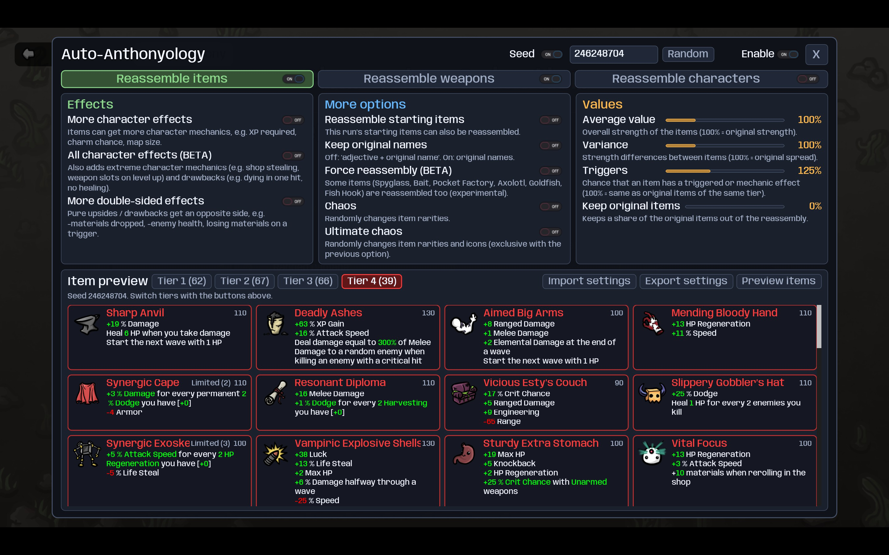
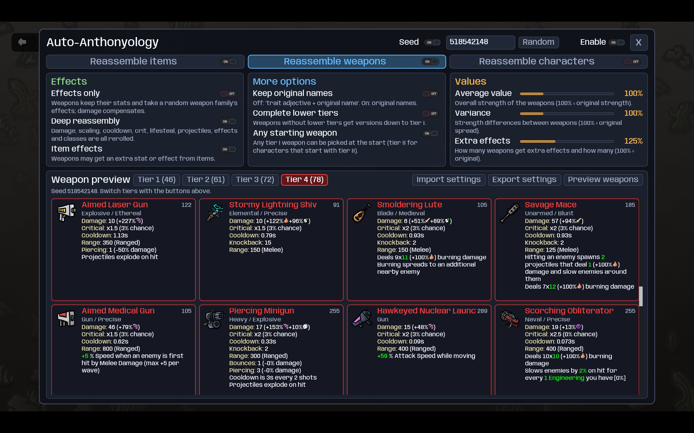
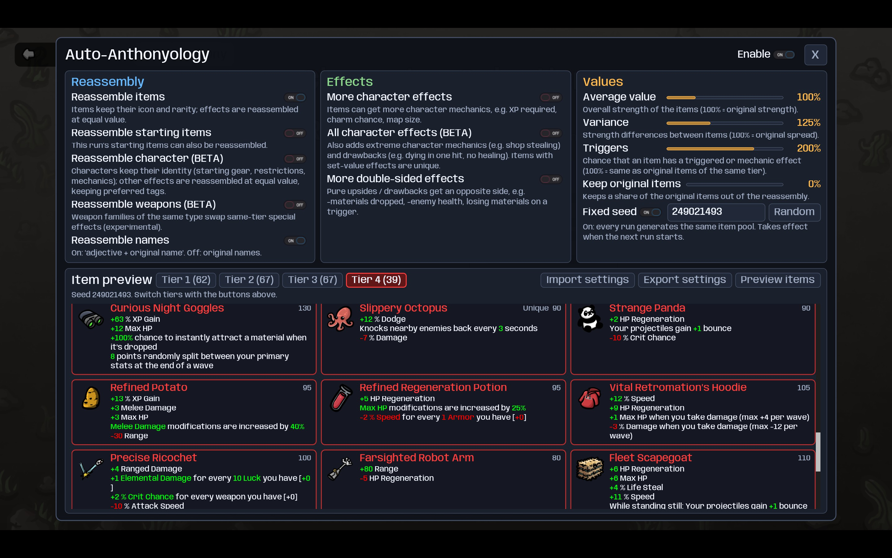
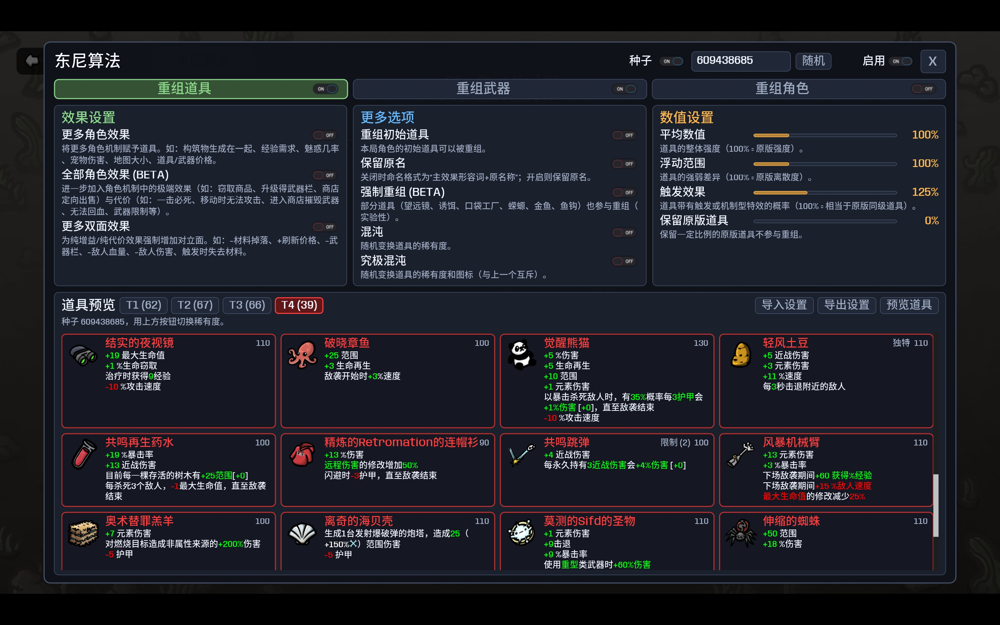
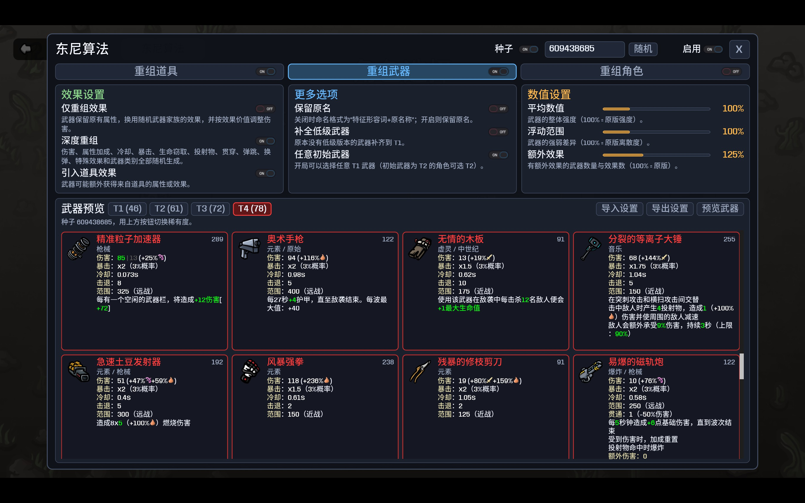
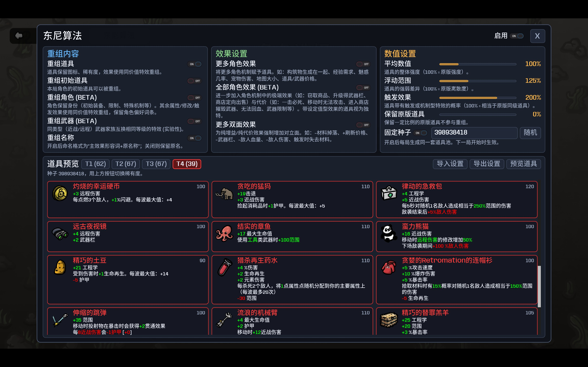

# Brotato: Auto-Anthonyology / 土豆兄弟：东尼算法

[Steam Workshop](https://steamcommunity.com/sharedfiles/filedetails/?id=3671094202) | [Open in Steam Client](https://link.steam.watch/url/CommunityFilePage/3671094202)

[English](#english) | [中文](#中文)

> modid: Mojimoon-AutoAnthony  
> Design Docs / 设计文档：[DESIGN.md](DESIGN.md)

## English

**Every run, brand-new items and weapons.** Auto-Anthonyology breaks every item and weapon into its parts — stats, triggers, effects, mechanics — and puts them back together at random, at the same value. Same icons, same rarities, completely different items.

Inspired by the *Auto-Anthonyology* mod for Slay the Spire 2, which itself comes from Challenge #45 of The Binding of Isaac: Repentance. Many thanks to the original author!

### How to use

On the character, weapon or difficulty selection screen, click **Auto-Anthony** in the top-left corner (next to the back button). Pick your options, preview if you like, then start a run. The weapon selection screen already shows the reassembled weapons; going back to the main menu restores the original game.

### Features

- **Any trigger, any effect**: "when you dodge", "every 5 seconds", "the first time you hit an enemy with Elemental Damage"... paired with any effect: stats, healing, materials, explosions, "enemies take more damage", or another item's effect.
- **Fair values**: every effect is priced in materials, fitted on the original items; weapons are priced by their equivalent DPS. Every item is worth its price.
- **Feels like Brotato**: stat lines, downsides, special effects and weapon stats all follow the originals of the same rarity; key stats and the tags your character wants are always available.
- **Reassemble weapons**: new effects, or completely new stats, scaling and classes, with optional lower-tier versions and any starting weapon.
- **Easy to use and compatible**: the seed is saved with your run, cursed items work as usual, items from other mods are untouched.
- **Full language support**: English, Français, 简体中文, 日本語, 한국어, 繁體中文, Русский, Polski, Español, Português, Deutsch, Türkçe, Italiano.

### Options

**General**: **Enable** (default **on**) is the master switch; the **seed** can be fixed to get the same content every run; **Export / Import settings** shares all settings (including the seed) as a code through the clipboard.

The settings have three tabs. The switch on each tab turns that part on or off.

**Reassemble items** (default **on**)

| Option | Default | What it does |
| --- | --- | --- |
| More character effects | Off | Items can get more character mechanics (XP required, charm chance, map size, "when you hit an enemy with a damage type"...). |
| All character effects (BETA) | Off | Also extreme character mechanics (shop stealing, weapon slots on level up...) and drawbacks (dying in one hit, no healing...). |
| More double-sided effects | Off | Pure upsides / drawbacks get an opposite side (-materials dropped, -enemy health, losing materials on a trigger...). |
| Reassemble starting items | Off | Your character's starting items are reassembled too. |
| Keep original names | Off | Off: "adjective + original name". |
| Force reassembly (BETA) | Off | Spyglass, Bait, Pocket Factory, Axolotl, Goldfish and Fish Hook are reassembled too. |
| Chaos / Ultimate chaos | Off | Shuffle item rarities / rarities and icons (pick one). |
| Average value / Variance / Triggers | 100% / 100% / 125% | Overall strength, strength spread, and how often items have triggered or mechanic effects (100% = original). |
| Keep original items | 0% | Keeps a share of the original items. |

**Reassemble weapons** (default off)

| Option | Default | What it does |
| --- | --- | --- |
| Effects only / Deep reassembly | Deep | Effects only: weapons keep their stats and take a random weapon's effects. Deep: damage, scaling, cooldown, crit, projectiles, effects and classes are all rerolled. Melee / ranged is kept. |
| Item effects | **On** | Weapons may get a stat or effect from items. |
| Keep original names | Off | Off: "trait adjective + original name". |
| Complete lower tiers | Off | Weapons without lower tiers (Sword, Rocket Launcher, Excalibur...) get versions down to tier I. |
| Any starting weapon | **On** | Pick any weapon of your character's starting tier. |
| Average value / Variance / Extra effects | 100% / 100% / 125% | Overall strength, strength spread, and how many weapons have extra effects (100% = original). |

**Reassemble characters (BETA)** (default off): characters keep their identity (starting gear, restrictions, special mechanics); their other stats and effects are reassembled at equal value, favouring their preferred tags.

The **preview** under the item and weapon tabs lists everything for the current settings and seed, without starting a run.

If you like this mod, please consider liking, favoriting and sharing it, thank you! Comments and suggestions are also very welcome!

<!-- BBCode

[b]Every run, brand-new items and weapons.[/b] Auto-Anthonyology breaks every item and weapon into its parts — stats, triggers, effects, mechanics — and puts them back together at random, at the same value. Same icons, same rarities, completely different items.

Inspired by the [i]Auto-Anthonyology[/i] mod for Slay the Spire 2, which itself comes from Challenge #45 of The Binding of Isaac: Repentance. Many thanks to the original author!

[h1]How to use[/h1]

On the character, weapon or difficulty selection screen, click [b]Auto-Anthony[/b] in the top-left corner (next to the back button). Pick your options, preview if you like, then start a run. The weapon selection screen already shows the reassembled weapons; going back to the main menu restores the original game.

[h1]Features[/h1]

[list]
[*][b]Any trigger, any effect[/b]: "when you dodge", "every 5 seconds", "the first time you hit an enemy with Elemental Damage"... paired with any effect: stats, healing, materials, explosions, "enemies take more damage", or another item's effect.
[*][b]Fair values[/b]: every effect is priced in materials, fitted on the original items; weapons are priced by their equivalent DPS. Every item is worth its price.
[*][b]Feels like Brotato[/b]: stat lines, downsides, special effects and weapon stats all follow the originals of the same rarity; key stats and the tags your character wants are always available.
[*][b]Reassemble weapons[/b]: new effects, or completely new stats, scaling and classes, with optional lower-tier versions and any starting weapon.
[*][b]Easy to use and compatible[/b]: the seed is saved with your run, cursed items work as usual, items from other mods are untouched.
[*][b]Full language support[/b]: English, Français, 简体中文, 日本語, 한국어, 繁體中文, Русский, Polski, Español, Português, Deutsch, Türkçe, Italiano.
[/list]

[h1]Options[/h1]

[b]General[/b]: [b]Enable[/b] (default [b]on[/b]) is the master switch; the [b]seed[/b] can be fixed to get the same content every run; [b]Export / Import settings[/b] shares all settings (including the seed) as a code through the clipboard.

The settings have three tabs. The switch on each tab turns that part on or off.

[h2]Reassemble items (default on)[/h2]

[table]
[tr][th]Option[/th][th]Default[/th][th]What it does[/th][/tr]
[tr][td]More character effects[/td][td]Off[/td][td]Items can get more character mechanics (XP required, charm chance, map size, "when you hit an enemy with a damage type"...).[/td][/tr]
[tr][td]All character effects (BETA)[/td][td]Off[/td][td]Also extreme character mechanics (shop stealing, weapon slots on level up...) and drawbacks (dying in one hit, no healing...).[/td][/tr]
[tr][td]More double-sided effects[/td][td]Off[/td][td]Pure upsides / drawbacks get an opposite side (-materials dropped, -enemy health, losing materials on a trigger...).[/td][/tr]
[tr][td]Reassemble starting items[/td][td]Off[/td][td]Your character's starting items are reassembled too.[/td][/tr]
[tr][td]Keep original names[/td][td]Off[/td][td]Off: "adjective + original name".[/td][/tr]
[tr][td]Force reassembly (BETA)[/td][td]Off[/td][td]Spyglass, Bait, Pocket Factory, Axolotl, Goldfish and Fish Hook are reassembled too.[/td][/tr]
[tr][td]Chaos / Ultimate chaos[/td][td]Off[/td][td]Shuffle item rarities / rarities and icons (pick one).[/td][/tr]
[tr][td]Average value / Variance / Triggers[/td][td]100% / 100% / 125%[/td][td]Overall strength, strength spread, and how often items have triggered or mechanic effects (100% = original).[/td][/tr]
[tr][td]Keep original items[/td][td]0%[/td][td]Keeps a share of the original items.[/td][/tr]
[/table]

[h2]Reassemble weapons (default off)[/h2]

[table]
[tr][th]Option[/th][th]Default[/th][th]What it does[/th][/tr]
[tr][td]Effects only / Deep reassembly[/td][td]Deep[/td][td]Effects only: weapons keep their stats and take a random weapon's effects. Deep: damage, scaling, cooldown, crit, projectiles, effects and classes are all rerolled. Melee / ranged is kept.[/td][/tr]
[tr][td]Item effects[/td][td][b]On[/b][/td][td]Weapons may get a stat or effect from items.[/td][/tr]
[tr][td]Keep original names[/td][td]Off[/td][td]Off: "trait adjective + original name".[/td][/tr]
[tr][td]Complete lower tiers[/td][td]Off[/td][td]Weapons without lower tiers (Sword, Rocket Launcher, Excalibur...) get versions down to tier I.[/td][/tr]
[tr][td]Any starting weapon[/td][td][b]On[/b][/td][td]Pick any weapon of your character's starting tier.[/td][/tr]
[tr][td]Average value / Variance / Extra effects[/td][td]100% / 100% / 125%[/td][td]Overall strength, strength spread, and how many weapons have extra effects (100% = original).[/td][/tr]
[/table]

[b]Reassemble characters (BETA)[/b] (default off): characters keep their identity (starting gear, restrictions, special mechanics); their other stats and effects are reassembled at equal value, favouring their preferred tags.

The [b]preview[/b] under the item and weapon tabs lists everything for the current settings and seed, without starting a run.

[pullquote]If you like this mod, please consider liking, favoriting and sharing it, thank you! Comments and suggestions are also very welcome![/pullquote]

GitHub repo: [url=https://github.com/mojimoon/BrotatoMods]mojimoon/BrotatoMods[/url]

-->

Screenshot

---

## 中文

**每一局，都是全新的道具和武器。** 东尼算法把每件道具和武器拆成零件——属性、触发条件、效果、机制——再按同等价值随机拼回去。图标和稀有度不变，内容却完全不同。

灵感来自《杀戮尖塔 2》的东尼算法（Auto-Anthonyology）mod，后者源于《以撒的结合：忏悔》中的挑战 45。在此向原作者致谢！

### 如何使用

在角色 / 武器 / 难度选择界面左上角（返回按钮旁）点击 **东尼算法**。选好设置，可以先预览，然后开始游戏。选择武器界面就会显示重组后的武器；回到主菜单后游戏自动还原。

### 特色

- **任意触发 × 任意效果**："闪避时""每 5 秒""首次用元素伤害命中敌人时"……可以搭配任意效果：属性、回血、材料、爆炸、"该敌人受到的伤害提高"，甚至是另一件道具的效果。
- **公平的数值**：每种效果都按材料计价，由原版道具拟合；武器按等效 DPS 计价。每件道具都值它的价格。
- **还是土豆兄弟的味道**：属性行数、代价、特殊效果、武器属性都跟随原版同稀有度；关键属性和角色想要的词条都保证存在。
- **重组武器**：换用新的效果，或者全新的属性、加成和武器类别；还可以补全低级武器、开局任选武器。
- **易用又兼容**：种子随存档保存；诅咒道具照常生效；其他 mod 添加的道具不受影响。
- **全语言支持**：English、Français、简体中文、日本語、한국어、繁體中文、Русский、Polski、Español、Português、Deutsch、Türkçe、Italiano。

### 选项说明

**通用**：**启用**（默认**开**）是总开关；**种子**可以固定，每局生成同样的内容；**导出 / 导入设置**通过剪贴板分享全部设置（含种子）。

设置分为三个页签，页签上的开关控制这一部分是否生效。

**重组道具**（默认**开**）

| 选项 | 默认 | 作用 |
| --- | --- | --- |
| 更多角色效果 | 关 | 道具可以获得更多角色机制（经验需求、魅惑几率、地图大小、"用某类伤害命中敌人时"……）。 |
| 全部角色效果 (BETA) | 关 | 进一步加入极端的角色机制（窃取商品、升级得武器栏……）与代价（一击必死、无法回血……）。 |
| 更多双面效果 | 关 | 为纯增益 / 纯代价效果加上对立面（-材料掉落、-敌人血量、触发时失去材料……）。 |
| 重组初始道具 | 关 | 角色的初始道具也参与重组。 |
| 保留原名 | 关 | 关闭时命名为"形容词+原名称"。 |
| 强制重组 (BETA) | 关 | 望远镜、诱饵、口袋工厂、蝾螈、金鱼、鱼钩也参与重组。 |
| 混沌 / 究极混沌 | 关 | 随机交换道具的稀有度 / 稀有度和图标（二选一）。 |
| 平均数值 / 浮动范围 / 触发效果 | 100% / 100% / 125% | 整体强度、强弱差异、带触发或机制效果的概率（100% = 原版）。 |
| 保留原版道具 | 0% | 保留一定比例的原版道具。 |

**重组武器**（默认关）

| 选项 | 默认 | 作用 |
| --- | --- | --- |
| 仅重组效果 / 深度重组 | 深度重组 | 仅重组效果：武器保留属性，换用随机武器的效果。深度重组：伤害、属性加成、冷却、暴击、投射物、效果和武器类别全部重新生成。近战 / 远程不变。 |
| 引入道具效果 | **开** | 武器可能获得来自道具的属性或效果。 |
| 保留原名 | 关 | 关闭时命名为"特征形容词+原名称"。 |
| 补全低级武器 | 关 | 原本没有低级版本的武器（剑、火箭筒、王者之剑……）补齐到 T1。 |
| 任意初始武器 | **开** | 开局可以选择角色初始稀有度的任意武器。 |
| 平均数值 / 浮动范围 / 额外效果 | 100% / 100% / 125% | 整体强度、强弱差异、有额外效果的武器数量（100% = 原版）。 |

**重组角色 (BETA)**（默认关）：角色保留身份（初始装备、限制、特殊机制），其余属性和效果按同等价值重组，偏向角色的偏好词条。

道具页与武器页下方的**预览**可以在开局前按当前设置与种子列出全部内容。

<!-- BBCode

[b]每一局，都是全新的道具和武器。[/b] 东尼算法把每件道具和武器拆成零件——属性、触发条件、效果、机制——再按同等价值随机拼回去。图标和稀有度不变，内容却完全不同。

灵感来自《杀戮尖塔 2》的东尼算法（Auto-Anthonyology）mod，后者源于《以撒的结合：忏悔》中的挑战 45。在此向原作者致谢！

[h1]如何使用[/h1]

在角色 / 武器 / 难度选择界面左上角（返回按钮旁）点击 [b]东尼算法[/b]。选好设置，可以先预览，然后开始游戏。选择武器界面就会显示重组后的武器；回到主菜单后游戏自动还原。

[h1]特色[/h1]

[list]
[*][b]任意触发 × 任意效果[/b]："闪避时""每 5 秒""首次用元素伤害命中敌人时"……可以搭配任意效果：属性、回血、材料、爆炸、"该敌人受到的伤害提高"，甚至是另一件道具的效果。
[*][b]公平的数值[/b]：每种效果都按材料计价，由原版道具拟合；武器按等效 DPS 计价。每件道具都值它的价格。
[*][b]还是土豆兄弟的味道[/b]：属性行数、代价、特殊效果、武器属性都跟随原版同稀有度；关键属性和角色想要的词条都保证存在。
[*][b]重组武器[/b]：换用新的效果，或者全新的属性、加成和武器类别；还可以补全低级武器、开局任选武器。
[*][b]易用又兼容[/b]：种子随存档保存；诅咒道具照常生效；其他 mod 添加的道具不受影响。
[*][b]全语言支持[/b]：English、Français、简体中文、日本語、한국어、繁體中文、Русский、Polski、Español、Português、Deutsch、Türkçe、Italiano。
[/list]

[h1]选项说明[/h1]

[b]通用[/b]：[b]启用[/b]（默认[b]开[/b]）是总开关；[b]种子[/b]可以固定，每局生成同样的内容；[b]导出 / 导入设置[/b]通过剪贴板分享全部设置（含种子）。

设置分为三个页签，页签上的开关控制这一部分是否生效。

[h2]重组道具（默认开）[/h2]

[table]
[tr][th]选项[/th][th]默认[/th][th]作用[/th][/tr]
[tr][td]更多角色效果[/td][td]关[/td][td]道具可以获得更多角色机制（经验需求、魅惑几率、地图大小、"用某类伤害命中敌人时"……）。[/td][/tr]
[tr][td]全部角色效果 (BETA)[/td][td]关[/td][td]进一步加入极端的角色机制（窃取商品、升级得武器栏……）与代价（一击必死、无法回血……）。[/td][/tr]
[tr][td]更多双面效果[/td][td]关[/td][td]为纯增益 / 纯代价效果加上对立面（-材料掉落、-敌人血量、触发时失去材料……）。[/td][/tr]
[tr][td]重组初始道具[/td][td]关[/td][td]角色的初始道具也参与重组。[/td][/tr]
[tr][td]保留原名[/td][td]关[/td][td]关闭时命名为"形容词+原名称"。[/td][/tr]
[tr][td]强制重组 (BETA)[/td][td]关[/td][td]望远镜、诱饵、口袋工厂、蝾螈、金鱼、鱼钩也参与重组。[/td][/tr]
[tr][td]混沌 / 究极混沌[/td][td]关[/td][td]随机交换道具的稀有度 / 稀有度和图标（二选一）。[/td][/tr]
[tr][td]平均数值 / 浮动范围 / 触发效果[/td][td]100% / 100% / 125%[/td][td]整体强度、强弱差异、带触发或机制效果的概率（100% = 原版）。[/td][/tr]
[tr][td]保留原版道具[/td][td]0%[/td][td]保留一定比例的原版道具。[/td][/tr]
[/table]

[h2]重组武器（默认关）[/h2]

[table]
[tr][th]选项[/th][th]默认[/th][th]作用[/th][/tr]
[tr][td]仅重组效果 / 深度重组[/td][td]深度重组[/td][td]仅重组效果：武器保留属性，换用随机武器的效果。深度重组：伤害、属性加成、冷却、暴击、投射物、效果和武器类别全部重新生成。近战 / 远程不变。[/td][/tr]
[tr][td]引入道具效果[/td][td][b]开[/b][/td][td]武器可能获得来自道具的属性或效果。[/td][/tr]
[tr][td]保留原名[/td][td]关[/td][td]关闭时命名为"特征形容词+原名称"。[/td][/tr]
[tr][td]补全低级武器[/td][td]关[/td][td]原本没有低级版本的武器（剑、火箭筒、王者之剑……）补齐到 T1。[/td][/tr]
[tr][td]任意初始武器[/td][td][b]开[/b][/td][td]开局可以选择角色初始稀有度的任意武器。[/td][/tr]
[tr][td]平均数值 / 浮动范围 / 额外效果[/td][td]100% / 100% / 125%[/td][td]整体强度、强弱差异、有额外效果的武器数量（100% = 原版）。[/td][/tr]
[/table]

[b]重组角色 (BETA)[/b]（默认关）：角色保留身份（初始装备、限制、特殊机制），其余属性和效果按同等价值重组，偏向角色的偏好词条。

道具页与武器页下方的[b]预览[/b]可以在开局前按当前设置与种子列出全部内容。

[pullquote]如果你喜欢这个 mod，欢迎点赞、收藏、转发，多谢啦！有问题或建议欢迎在评论区留言！[/pullquote]

GitHub 仓库：[url=https://github.com/mojimoon/BrotatoMods]mojimoon/BrotatoMods[/url]

-->

截图

<!--

土豆兄弟：东尼算法 (Brotato: Auto-Anthonyology)

每一局，都是全新的道具和武器！东尼算法把每件道具和武器拆成属性、触发条件、效果和机制，再按同等价值随机拼回去：图标和稀有度不变，内容却完全不同。

"闪避时""首次用远程伤害击中敌人时""敌袭过半时"……任何触发条件都能搭配任何效果；数值按原版拟合，有千万种组合，还是熟悉的土豆兄弟手感。武器也能重组：换效果，或者伤害、加成、冷却、类别全部重新生成。想要更刺激的体验，还可以重组角色、加入一击必死和偷窃商店等角色机制、开启混沌打乱稀有度。

灵感来自《杀戮尖塔 2》的东尼算法 mod 与《以撒的结合：忏悔》挑战 45。快用分享码一键分享你的道具池！

创意工坊：https://steamcommunity.com/sharedfiles/filedetails/?id=3671094202

-->
