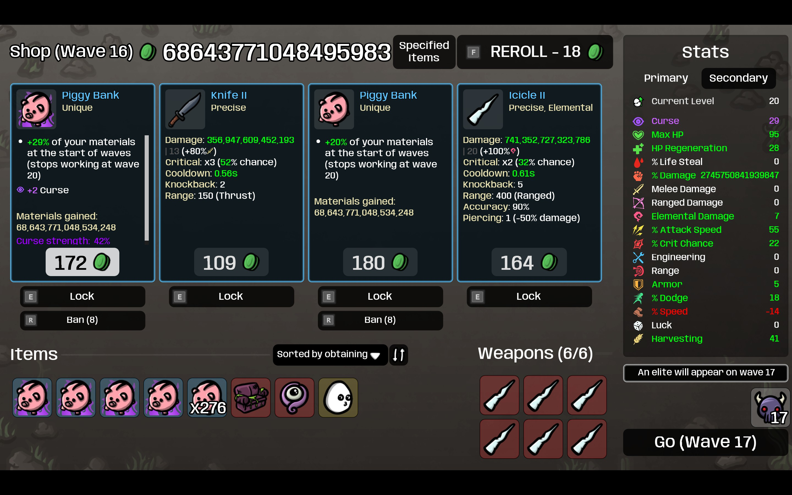
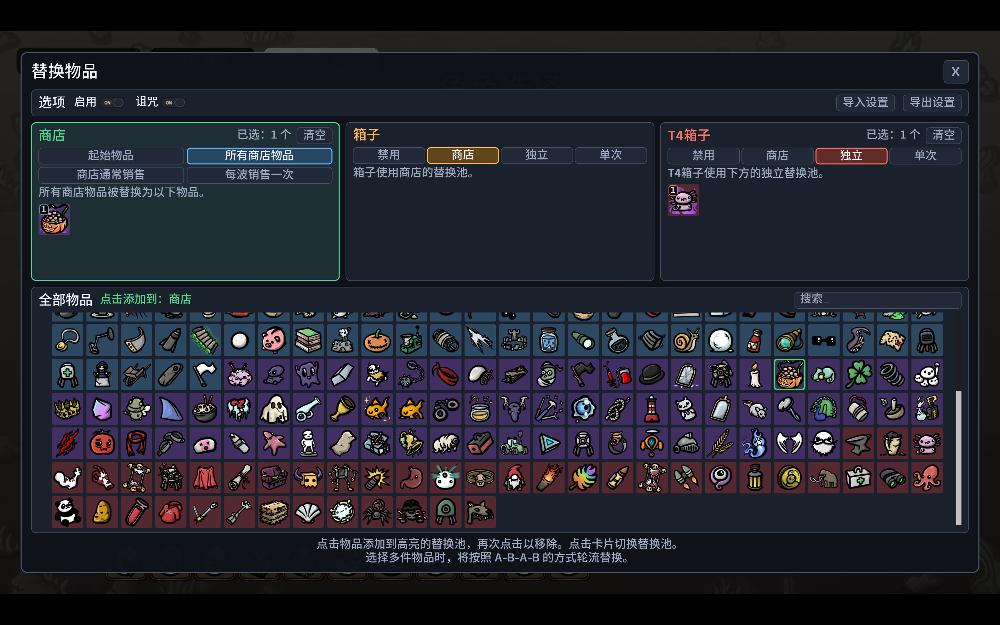
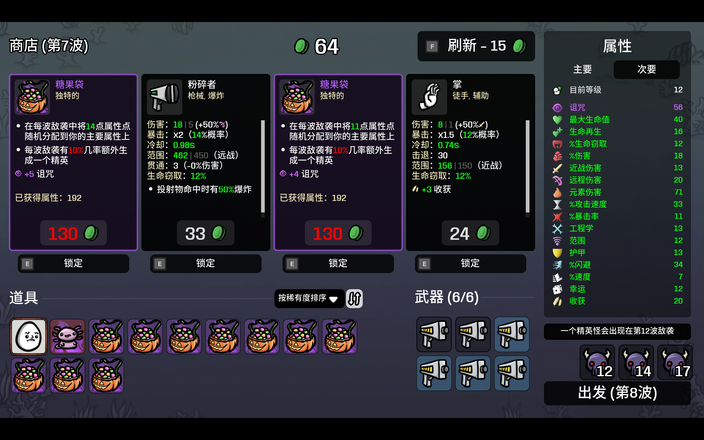
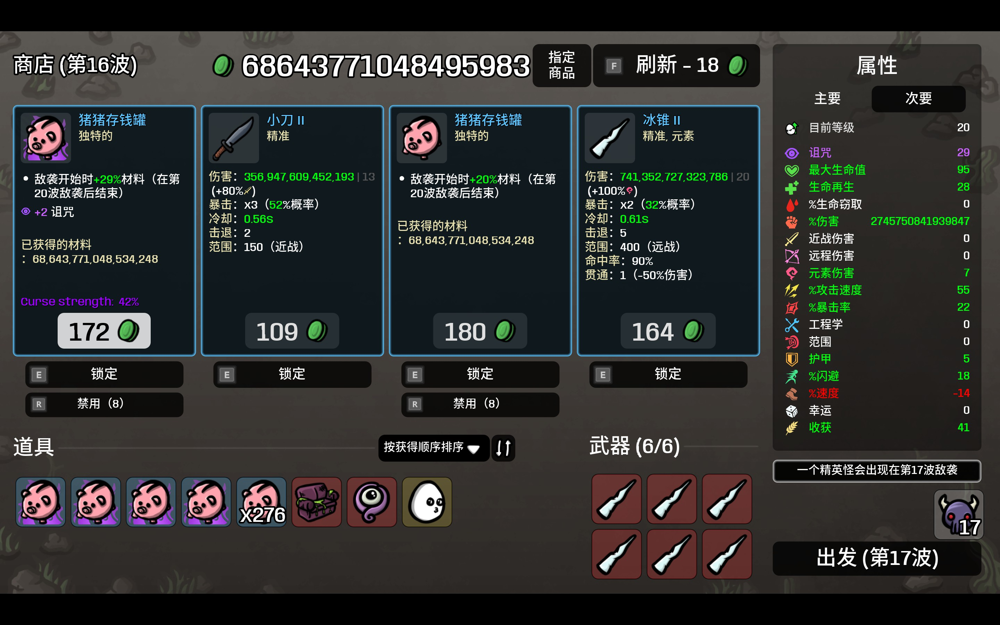

# One Item to Rule Them All v2 / 假如所有道具变成

[Steam Workshop](https://steamcommunity.com/sharedfiles/filedetails/?id=3808638762) | [Open in Steam Client](https://link.steam.watch/url/CommunityFilePage/3808638762)

[English](#english) | [中文](#中文)

> modid: Mojimoon-OneItemToRuleThemAllv2

## English

**What if every item turned into a Potato, a Gentle Alien, a Candy Bag...?** This mod is all you need: One Item to Rule Them All.

**Now with a major upgrade**: a brand-new UI, better UX, three side-by-side replacement pools (shop, crates, T4 crates), and settings import/export!

### How to use

After picking a character, click **Replace Items** in the top-left corner of the character/weapon/difficulty selection screen. Pick the items you want from the list, then start the run. That's it!

### Features

- **Round-robin rotation**: pick several items and they take turns (e.g., A-B-A-B), in the order you chose them.
- **Separate pools**: shops, crates and T4 crates each get their own items, or replace only the first few crates.
- **Import / export**: share your whole setup as a code through the clipboard.
- **Detailed yet intuitive UI**: item search, rarity colors, numbered pools, and a live description of exactly what will be replaced.
- **Full language support**: English, Français, 简体中文, 日本語, 한국어, 繁體中文, Русский, Polski, Español, Português, Deutsch, Türkçe, Italiano.

### Options

**Enable** (default: **on**): the master switch. When it's off, nothing is replaced and your settings are kept.

**Curse** (default: off): replaced items are always cursed (random strength that grows with the wave, just like naturally cursed items). *Requires the Abyssal Terrors DLC*.

Even when it's off, a curse on the original item carries over to its replacement.

The three cards each have their own replacement pool.

**Shop**

| Option | Default | What it does |
| --- | --- | --- |
| Starting items | Off | Your character's starting items (the character itself and weapons are untouched). |
| All items in shop | **On** | Every item slot in the shop (weapons are untouched). |
| Shops always sell | Off | Upon each shop reroll, one of the slots is guaranteed to be one of the selected items. |
| Sold once per wave | Off | Each wave, the shop will sell all of the selected items once, then back to random. |

"All items in shop", "Shops always sell" and "Sold once per wave" are mutually exclusive, at most one of them can be enabled.

**Crate / T4 Crate**

Crates (including the extra items from treasure maps) and T4 crates are configured separately, each with four modes:

| Mode | What it does |
| --- | --- |
| Off | Still generated randomly. |
| Shop | Use the Shop pool. |
| Independent | Use the card's own pool, rotating A-B-A-B. |
| One-time | The first N crates become your N items, in order. After that, back to random. |

Defaults: Crate = **Shop**, T4 Crate = **Off**.

**Import / Export**

The **Import settings** and **Export settings** buttons at the top copy all of your settings to the clipboard as a share code, or load them back from it. Handy for sharing a setup with friends.

### Try these combos

Content creators on Bilibili have already come up with plenty of fun combos (videos in Chinese):

- [Loud + Gentle Alien](https://www.bilibili.com/video/BV1XHhZ6wEwJ/): more enemies, more materials; more materials, more enemies
- [Jack + Candy Bag](https://www.bilibili.com/video/BV1jeag6kEDy/): snowball your stats and grab red items for free
- [Demon + Potato](https://www.bilibili.com/video/BV1VDhb6SEbd/): just stats
- [Cryptid + Tree](https://www.bilibili.com/video/BV1vUaZ6qEAC/): survival and economy is all you need

Got a fun combo of your own? Post a video or share it in the comments!

Note: this is an entirely different mod. **Do not enable v1 and v2 at the same time.**

<!-- BBCode

[b]What if every item turned into a Potato, a Gentle Alien, a Candy Bag...?[/b] This mod is all you need: One Item to Rule Them All.

[b]Now with a major upgrade[/b]: a brand-new UI, better UX, three side-by-side replacement pools (shop, crates, T4 crates), and settings import/export!

[h1]How to use[/h1]

After picking a character, click [b]Replace Items[/b] in the top-left corner of the character/weapon/difficulty selection screen. Pick the items you want from the list, then start the run. That's it!

[h1]Features[/h1]

[list]
[*][b]Round-robin rotation[/b]: pick several items and they take turns (e.g., A-B-A-B), in the order you chose them.
[*][b]Separate pools[/b]: shops, crates and T4 crates each get their own items, or replace only the first few crates.
[*][b]Import / export[/b]: share your whole setup as a code through the clipboard.
[*][b]Detailed yet intuitive UI[/b]: item search, rarity colors, numbered pools, and a live description of exactly what will be replaced.
[*][b]Full language support[/b]: English, Français, 简体中文, 日本語, 한국어, 繁體中文, Русский, Polski, Español, Português, Deutsch, Türkçe, Italiano.
[/list]

[h1]Options[/h1]

[b]Enable[/b] (default: [b]on[/b]): the master switch. When it's off, nothing is replaced and your settings are kept.

[b]Curse[/b] (default: off): replaced items are always cursed (random strength that grows with the wave, just like naturally cursed items). [i]Requires the Abyssal Terrors DLC[/i].

Even when it's off, a curse on the original item carries over to its replacement.

The three cards each have their own replacement pool.

[h2]Shop[/h2]

[table]
[tr][th]Option[/th][th]Default[/th][th]What it does[/th][/tr]
[tr][td]Starting items[/td][td]Off[/td][td]Your character's starting items (the character itself and weapons are untouched).[/td][/tr]
[tr][td]All items in shop[/td][td][b]On[/b][/td][td]Every item slot in the shop (weapons are untouched).[/td][/tr]
[tr][td]Shops always sell[/td][td]Off[/td][td]Upon each shop reroll, one of the slots is guaranteed to be one of the selected items.[/td][/tr]
[tr][td]Sold once per wave[/td][td]Off[/td][td]Each wave, the shop will sell all of the selected items once, then back to random.[/td][/tr]
[/table]

"All items in shop", "Shops always sell" and "Sold once per wave" are mutually exclusive, at most one of them can be enabled.

[h2]Crate / T4 Crate[/h2]

Crates (including the extra items from treasure maps) and T4 crates are configured separately, each with four modes:

[table]
[tr][th]Mode[/th][th]What it does[/th][/tr]
[tr][td]Off[/td][td]Still generated randomly.[/td][/tr]
[tr][td]Shop[/td][td]Use the Shop pool.[/td][/tr]
[tr][td]Independent[/td][td]Use the card's own pool, rotating A-B-A-B.[/td][/tr]
[tr][td]One-time[/td][td]The first N crates become your N items, in order. After that, back to random.[/td][/tr]
[/table]

Defaults: Crate = [b]Shop[/b], T4 Crate = [b]Off[/b].

[h2]Import / Export[/h2]

The [b]Import settings[/b] and [b]Export settings[/b] buttons at the top copy all of your settings to the clipboard as a share code, or load them back from it. Handy for sharing a setup with friends.

[h1]Try these combos[/h1]

Content creators on Bilibili have already come up with plenty of fun combos (videos in Chinese):

[list]
[*][url=https://www.bilibili.com/video/BV1XHhZ6wEwJ/]Loud + Gentle Alien[/url]: more enemies, more materials; more materials, more enemies
[*][url=https://www.bilibili.com/video/BV1jeag6kEDy/]Jack + Candy Bag[/url]: snowball your stats and grab red items for free
[*][url=https://www.bilibili.com/video/BV1VDhb6SEbd/]Demon + Potato[/url]: just stats
[*][url=https://www.bilibili.com/video/BV1vUaZ6qEAC/]Cryptid + Tree[/url]: survival and economy is all you need
[/list]

Got a fun combo of your own? Post a video or share it in the comments!

Note: this is an entirely different mod. [pullquote]Do not enable v1 and v2 at the same time.[/pullquote]

[pullquote]If you like this mod, please consider liking, favoriting and sharing it, thank you! Comments and suggestions are also very welcome![/pullquote]

[img]https://images.steamusercontent.com/ugc/44567523600397314/6B6642339A9CBFF3E081B3CC347F70D6EFD2F0D7/[/img]

GitHub repo: [url=https://github.com/mojimoon/BrotatoMods]mojimoon/BrotatoMods[/url]

-->

Screenshots

---

## 中文

**假如所有道具变成土豆、外星绅士、糖果袋……** 你只需要这个 mod，One Item to Rule Them All。

**现已迎来重大升级**，全新 UI、交互优化，商店、箱子、T4 箱子三个替换池并排显示，还能导入导出设置！

### 如何使用

选择角色后，在角色/武器/难度选择界面左上角点击 **替换物品**。在物品列表中选择想要替换的物品，然后开始游戏。就这么简单！

### 特色

- **A-B-A-B 轮流替换**：选多件物品时，按选择顺序轮流出现。
- **独立替换池**：商店、箱子、T4 箱子各自指定物品，或者只替换前几个箱子。
- **导入 / 导出**：通过剪贴板分享整套设置。
- **详细又直观的 UI**：搜索道具、稀有度底色、带序号的替换池，还会实时告诉你哪些东西会被替换。
- **全语言支持**：English、Français、简体中文、日本語、한국어、繁體中文、Русский、Polski、Español、Português、Deutsch、Türkçe、Italiano。

### 选项说明

**启用**（默认：**开**）：总开关。关闭后不做任何替换，设置保留。

**诅咒**（默认：关）：替换后的物品固定被诅咒（强度随机并随波次提升，和游戏里自然出现的诅咒物品一致）。*需要深海魔怪 DLC*。

即使关闭，原物品被诅咒时，也会传递到替换后的物品上。

三张卡片各自拥有独立的替换池。

**商店**

| 选项 | 默认 | 作用 |
| --- | --- | --- |
| 起始物品 | 关 | 角色开局自带的物品（不含角色本身和武器）。 |
| 所有商店物品 | **开** | 商店里的所有物品槽位（不含武器）。 |
| 商店通常销售 | 关 | 每次商店刷新时，固定有一个槽位是所选物品之一。 |
| 每波销售一次 | 关 | 每波商店固定销售所选的所有物品各一次，这之后恢复随机。 |

“所有商店物品”、“商店通常销售”和“每波销售一次”互斥，最多只能启用其中一个。

**箱子 / T4箱子**

箱子（含藏宝图的额外物品）和 T4 箱子分别设置，各有四种模式：

| 模式 | 作用 |
| --- | --- |
| 禁用 | 仍然随机生成。 |
| 商店 | 使用商店的替换池。 |
| 独立 | 使用该卡片自己的替换池，A-B-A-B 轮流替换。 |
| 单次 | 前 N 个箱子按顺序变成你选的 N 件物品，之后恢复随机。 |

默认值：箱子 = **商店**，T4 箱子 = **禁用**。

**导入 / 导出**

顶部的 **导入设置** 和 **导出设置** 按钮可以把全部设置作为分享码复制到剪贴板，或从剪贴板读取。方便和朋友分享配置。

### 试试这些组合

B 站 UP 主们已经做了很多有趣的组合，欢迎参考：

- [大嗓门 + 外星绅士](https://www.bilibili.com/video/BV1XHhZ6wEwJ/)：怪物越多经济越多，经济越多怪物越多
- [杰克 + 糖果袋](https://www.bilibili.com/video/BV1jeag6kEDy/)：滚雪球还能白嫖红色道具
- [恶魔 + 土豆](https://www.bilibili.com/video/BV1VDhb6SEbd/)：纯粹的数值
- [神秘生物 + 树](https://www.bilibili.com/video/BV1vUaZ6qEAC/)：生存经济两手抓

你也有好玩的组合？欢迎发视频或分享到评论区！

注意：这是一个全新的 mod，**请不要同时启用 v1 和 v2**。

<!-- BBCode

[b]假如所有道具变成土豆、外星绅士、糖果袋……[/b] 你只需要这个 mod，One Item to Rule Them All。

[b]现已迎来重大升级[/b]，全新 UI、交互优化，商店、箱子、T4 箱子三个替换池并排显示，还能导入导出设置！

[h1]如何使用[/h1]

选择角色后，在角色/武器/难度选择界面左上角点击 [b]替换物品[/b]。在物品列表中选择想要替换的物品，然后开始游戏。就这么简单！

[h1]特色[/h1]

[list]
[*][b]A-B-A-B 轮流替换[/b]：选多件物品时，按选择顺序轮流出现。
[*][b]独立替换池[/b]：商店、箱子、T4 箱子各自指定物品，或者只替换前几个箱子。
[*][b]导入 / 导出[/b]：通过剪贴板分享整套设置。
[*][b]详细又直观的 UI[/b]：搜索道具、稀有度底色、带序号的替换池，还会实时告诉你哪些东西会被替换。
[*][b]全语言支持[/b]：English、Français、简体中文、日本語、한국어、繁體中文、Русский、Polski、Español、Português、Deutsch、Türkçe、Italiano。
[/list]

[h1]选项说明[/h1]

[b]启用[/b]（默认：[b]开[/b]）：总开关。关闭后不做任何替换，设置保留。

[b]诅咒[/b]（默认：关）：替换后的物品固定被诅咒（强度随机并随波次提升，和游戏里自然出现的诅咒物品一致）。[i]需要深海魔怪 DLC[/i]。

即使关闭，原物品被诅咒时，也会传递到替换后的物品上。

三张卡片各自拥有独立的替换池。

[h2]商店[/h2]

[table]
[tr][th]选项[/th][th]默认[/th][th]作用[/th][/tr]
[tr][td]起始物品[/td][td]关[/td][td]角色开局自带的物品（不含角色本身和武器）。[/td][/tr]
[tr][td]所有商店物品[/td][td][b]开[/b][/td][td]商店里的所有物品槽位（不含武器）。[/td][/tr]
[tr][td]商店通常销售[/td][td]关[/td][td]每次商店刷新时，固定有一个槽位是所选物品之一。[/td][/tr]
[tr][td]每波销售一次[/td][td]关[/td][td]每波商店固定销售所选的所有物品各一次，这之后恢复随机。[/td][/tr]
[/table]

“所有商店物品”、“商店通常销售”和“每波销售一次”互斥，最多只能启用其中一个。

[h2]箱子 / T4箱子[/h2]

箱子（含藏宝图的额外物品）和 T4 箱子分别设置，各有四种模式：

[table]
[tr][th]模式[/th][th]作用[/th][/tr]
[tr][td]禁用[/td][td]仍然随机生成。[/td][/tr]
[tr][td]商店[/td][td]使用商店的替换池。[/td][/tr]
[tr][td]独立[/td][td]使用该卡片自己的替换池，A-B-A-B 轮流替换。[/td][/tr]
[tr][td]单次[/td][td]前 N 个箱子按顺序变成你选的 N 件物品，之后恢复随机。[/td][/tr]
[/table]

默认值：箱子 = [b]商店[/b]，T4 箱子 = [b]禁用[/b]。

[h2]导入 / 导出[/h2]

顶部的 [b]导入设置[/b] 和 [b]导出设置[/b] 按钮可以把全部设置作为分享码复制到剪贴板，或从剪贴板读取。方便和朋友分享配置。

[h1]试试这些组合[/h1]

B 站 UP 主们已经做了很多有趣的组合，欢迎参考：

[list]
[*][url=https://www.bilibili.com/video/BV1XHhZ6wEwJ/]大嗓门 + 外星绅士[/url]：怪物越多经济越多，经济越多怪物越多
[*][url=https://www.bilibili.com/video/BV1jeag6kEDy/]杰克 + 糖果袋[/url]：滚雪球还能白嫖红色道具
[*][url=https://www.bilibili.com/video/BV1VDhb6SEbd/]恶魔 + 土豆[/url]：纯粹的数值
[*][url=https://www.bilibili.com/video/BV1vUaZ6qEAC/]神秘生物 + 树[/url]：生存经济两手抓
[/list]

你也有好玩的组合？欢迎发视频或分享到评论区！

注意：这是一个全新的 mod，[pullquote]请不要同时启用 v1 和 v2。[/pullquote]

[pullquote]如果你喜欢这个 mod，欢迎点赞、收藏、转发，多谢啦！有问题或建议欢迎在评论区留言！[/pullquote]

[img]https://images.steamusercontent.com/ugc/44567523600397314/6B6642339A9CBFF3E081B3CC347F70D6EFD2F0D7/[/img]

GitHub 仓库：[url=https://github.com/mojimoon/BrotatoMods]mojimoon/BrotatoMods[/url]

-->

截图

<!--

假如所有道具变成 (One Item to Rule Them All v2)

假如所有道具都变成土豆、外星绅士、糖果袋……？装上这个 mod 就能实现！

v2 迎来重大升级：全新 UI、交互优化，商店、箱子、T4 箱子各有独立替换池，还能导入导出设置。开局前选好物品，商店和箱子里就只剩你选的那些。

B 站 UP 主们已经玩出了不少花样：大嗓门 + 外星绅士、杰克 + 糖果袋、恶魔 + 土豆……你也来试试？

创意工坊：https://steamcommunity.com/sharedfiles/filedetails/?id=3808638762

-->
