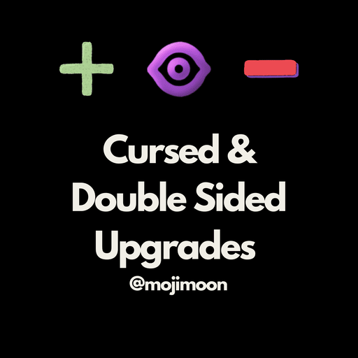
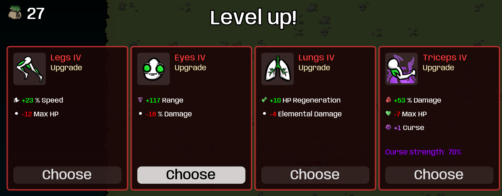
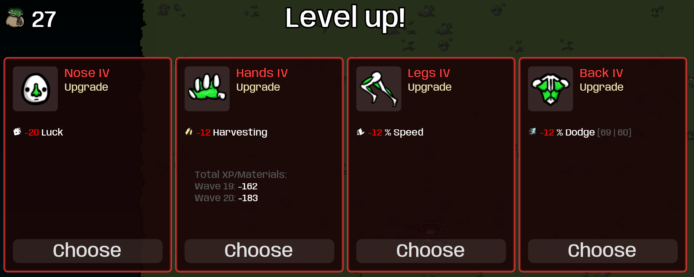
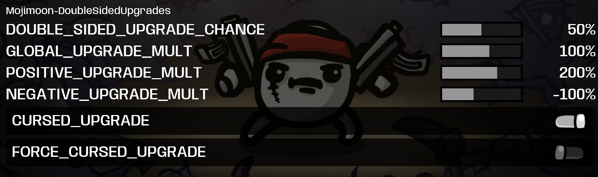

# BrotatoMods

A collection of mods for the game [Brotato](https://store.steampowered.com/app/1942280/Brotato/).

## [Double Sided Upgrades](Mojimoon-DoubleSidedUpgrades)

[Steam Workshop Link](https://steamcommunity.com/sharedfiles/filedetails/?id=3671945570)

Have you ever thought about the upgrades in Brotato being a bit too fixed? Then this mod is for you! It introduces the cursed and double-sided upgrade system and configurable upgrades effect strength.

Here's the default settings:

- 50% of the upgrades will be double-sided, which composes of a positive effect (200% of stat A) and a negative effect (-100% of stat B). For example, the attack speed upgrade at Tier 4 usually gives you +20% attack speed, but with this mod, you can now choose a double-sided upgrade that gives you +40% attack speed but -12% movement speed.
- If you have DLC installed, upgrades have a chance to be cursed just like any other item, which increases the positive effect and reduces the negative effect (if any).

By subscribing to [dami-ModOptions](https://steamcommunity.com/sharedfiles/filedetails/?id=2944608034), you can configure the following settings in-game (this is not required if you are fine with the default settings):

- DOUBLE_SIDED_UPGRADES_CHANCE: the chance for an upgrade to be double-sided (default: 50%)
- GLOBAL_UPGRADE_MULT: the global multiplier for all upgrade effects. Will affect both positive and negative effects multiplicatively (default: 100%)
- POSITIVE_UPGRADE_MULT: the multiplier for the positive effect of double-sided upgrades (default: 200%)
- NEGATIVE_UPGRADE_MULT: the multiplier for the negative effect of double-sided upgrades (default: -100%)
- CURSED_UPGRADE: enable cursed upgrades (default: true)
- FORCE_CURSED_UPGRADE: force all upgrades to be cursed. Only works if CURSED_UPGRADE is enabled (default: false)

There are many fun ways to play with these settings. If you are a masochist, try -100% Mutant and see your stats weaken as you level up! If you want to be overpowered, check out +500% Baby and see how crazy it is to get 5 weapon slots from one upgrade!

If you like this mod, please consider liking, favoriting and sharing it, thank you! Comments and suggestions are also very welcome!

---

你是否觉得Brotato中的升级有点过于固定了？那么好，这个 mod 引入了诅咒和双面升级，以及可自定义的升级效果强度。

默认设置如下：

- 50%的升级会变成双面升级，由一个正面效果（200%的属性A）和一个负面效果（-100%的属性B）组成。例如，T4的攻速升级通常会给你+20%攻速，但有了这个 mod，你现在还可以选择一个双面升级，获得+40%攻速但-12%速度。
- 如果你安装了DLC，升级和其他物品一样有可能被诅咒，增加正面效果并减少负面效果。

通过订阅[dami-ModOptions](https://steamcommunity.com/sharedfiles/filedetails/?id=2944608034)，你可以在游戏中配置以下设置：（这不是个强制依赖，如果你对默认设置满意的话，不装也行）

- DOUBLE_SIDED_UPGRADES_CHANCE：升级变成双面升级的概率（默认：50%）
- GLOBAL_UPGRADE_MULT：所有升级效果的倍率。和下面两个叠乘（默认：100%）
- POSITIVE_UPGRADE_MULT：双面升级中正面效果的倍率（默认：200%）
- NEGATIVE_UPGRADE_MULT：双面升级中负面效果的倍率（默认：-100%）
- CURSED_UPGRADE：允许升级被诅咒（默认：true）
- FORCE_CURSED_UPGRADE：强制所有升级都被诅咒。只有在启用CURSED_UPGRADE的情况下才有效（默认：false）

有很多有趣的玩法可以尝试。如果你是个抖M，不妨试试 -100% 异变体，看看全红的升级好不好受。或者如果你想要一些乐子，试试 +500% 宝宝，看看升级一次拿5个武器栏有多爽！

如果你喜欢这个 mod，欢迎点赞、收藏、转发，多谢啦！有问题或建议欢迎在评论区留言。

Screenshots

