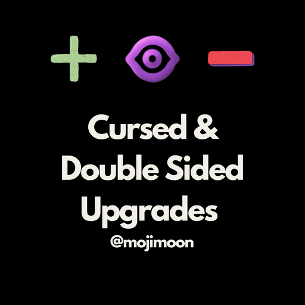
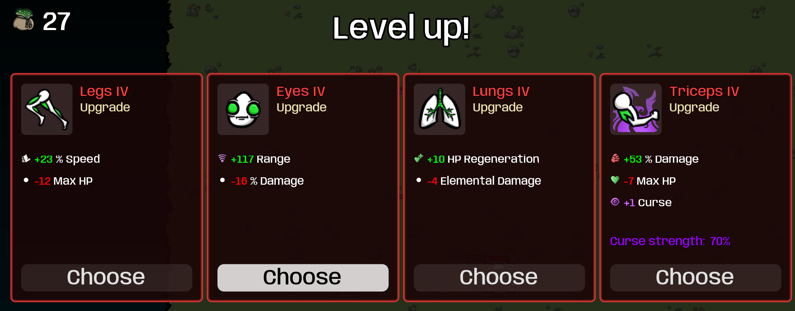
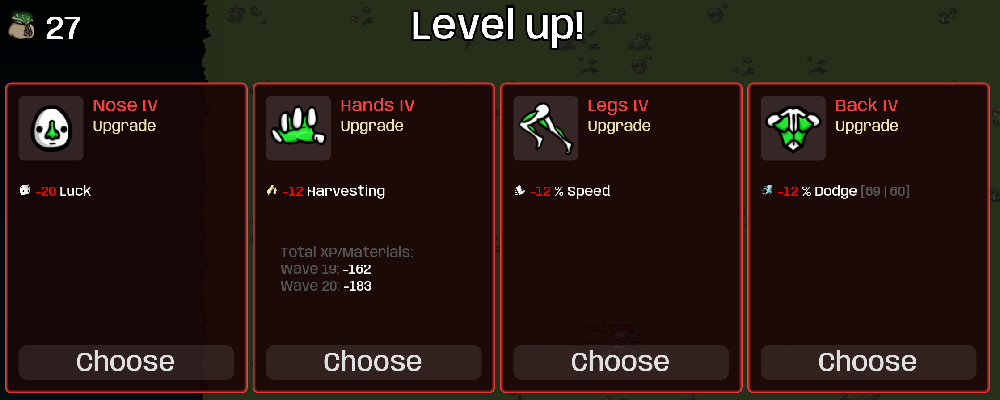
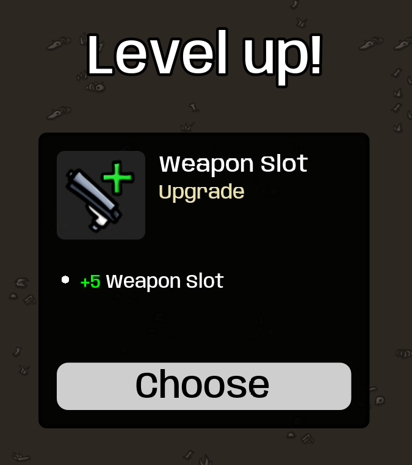
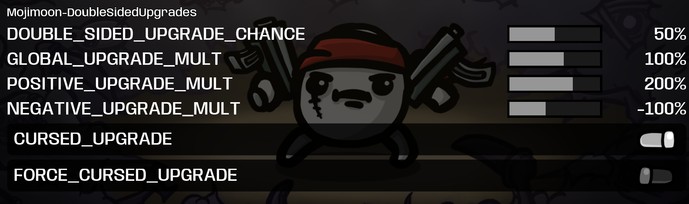
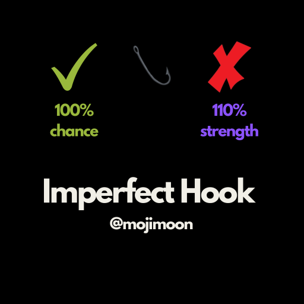

# BrotatoMods

A collection of mods for the game [Brotato](https://store.steampowered.com/app/1942280/Brotato/).

## [Double Sided Upgrades](Mojimoon-DoubleSidedUpgrades)

[Steam Workshop Link](https://steamcommunity.com/sharedfiles/filedetails/?id=3671945570)

> Cursed & Double Sided Upgrades / 诅咒和双面升级

Have you ever thought about the upgrades in Brotato being a bit too fixed? Then this mod is for you! It introduces the **cursed** and **double-sided** upgrade system and **configurable upgrades effect** strength. **And now supports co-op!**

### What does it do?

- 50% of the upgrades will be double-sided, meaning they will have both a positive and a negative effect. The positive effect will be +200% of the original stat increase, while the negative effect will be -100% of another stat. For example, the T4 damage upgrade usually gives you +16% damage, but with this mod, you can now choose a double-sided upgrade that gives you +32% damage but -60 range.
- If DLC Abyssal Terrors is installed, upgrades share the same chance to be cursed as other items, which increases the positive effect and reduces the negative effect (if any).

### Mod Options

By subscribing to [dami-ModOptions](https://steamcommunity.com/sharedfiles/filedetails/?id=2944608034) (you can find it on the right sidebar), you can configure the following settings in-game (this is not required if you are fine with the default settings):

- DOUBLE_SIDED_UPGRADES_CHANCE: the chance for an upgrade to be double-sided (default: 50%)
- GLOBAL_UPGRADE_MULT: the global multiplier for all upgrade effects. Stacks multiplicatively with the following two multipliers (default: 100%)
- POSITIVE_UPGRADE_MULT: the multiplier for the positive effect of double-sided upgrades (default: 200%)
- NEGATIVE_UPGRADE_MULT: the multiplier for the negative effect of double-sided upgrades (default: -100%)
- CURSED_UPGRADE: enable cursed upgrades. Only works if you have DLC Abyssal Terrors installed (default: true)
- FORCE_CURSED_UPGRADE: force all upgrades to be cursed. Only works if CURSED_UPGRADE is enabled (default: false)

### Try it out!

There are many fun ways to play with these settings. If you are a masochist, try -100% Mutant and see your stats weaken as you level up! If you want to be overpowered, check out +500% Baby and see how crazy it is to get 5 weapon slots from one upgrade!

If you like this mod, please consider liking, favoriting and sharing it, thank you! Comments and suggestions are also very welcome!

<!-- BBCode

Have you ever thought about the upgrades in Brotato being a bit too fixed? Then this mod is for you! It introduces the [b]cursed[/b] and [b]double-sided[/b] upgrade system and [b]configurable upgrades effect[/b] strength. [pullquote]And now supports co-op![/pullquote]

[h1]What does it do?[/h1]

[list]
[*]50% of the upgrades will be double-sided, meaning they will have both a positive and a negative effect. The positive effect will be +200% of the original stat increase, while the negative effect will be -100% of another stat. For example, the T4 damage upgrade usually gives you +16% damage, but with this mod, you can now choose a double-sided upgrade that gives you +32% damage but -60 range.
[*]If DLC Abyssal Terrors is installed, upgrades share the same chance to be cursed as other items, which increases the positive effect and reduces the negative effect (if any).
[/list]

[h1]Mod Options[/h1]
By subscribing to [url=https://steamcommunity.com/sharedfiles/filedetails/?id=2944608034]dami-ModOptions[/url] (you can find it on the right sidebar), you can configure the following settings in-game (this is not required if you are fine with the default settings):

[list]
[*]DOUBLE_SIDED_UPGRADES_CHANCE: the chance for an upgrade to be double-sided (default: 50%)
[*]GLOBAL_UPGRADE_MULT: the global multiplier for all upgrade effects. Stacks multiplicatively with the following two multipliers (default: 100%)
[*]POSITIVE_UPGRADE_MULT: the multiplier for the positive effect of double-sided upgrades (default: 200%)
[*]NEGATIVE_UPGRADE_MULT: the multiplier for the negative effect of double-sided upgrades (default: -100%)
[*]CURSED_UPGRADE: enable cursed upgrades. Only works if you have DLC Abyssal Terrors installed (default: true)
[*]FORCE_CURSED_UPGRADE: force all upgrades to be cursed. Only works if CURSED_UPGRADE is enabled (default: false)
[/list]

[h1]Try it out![/h1]

There are many fun ways to play with these settings. If you are a masochist, try -100% Mutant and see your stats weaken as you level up! If you want to be overpowered, check out +500% Baby and see how crazy it is to get 5 weapon slots from one upgrade!

[pullquote]If you like this mod, please consider liking, favoriting and sharing it, thank you! Comments and suggestions are also very welcome![/pullquote]

[img]https://images.steamusercontent.com/ugc/44567523600397314/6B6642339A9CBFF3E081B3CC347F70D6EFD2F0D7/[/img]

GitHub repo: [url=https://github.com/mojimoon/BrotatoMods]mojimoon/BrotatoMods[/url]

-->

---

你是否觉得Brotato中的升级有点过于固定了？那你可找对地方了！这个 mod 引入了 **诅咒** 和 **双面** 升级系统，以及 **可自定义的升级效果** 强度。**现已支持合作模式！**

### 干什么的？

- 50% 的升级会变成双面升级，拥有一个正面效果和一个负面效果。正面效果会增加 200% 的原属性，而负面效果会减少 100% 的另一个主属性。例如，T4 的伤害升级是 +16% 伤害，但有了这个 mod，你现在可以选择一个双面升级，获得 +32% 伤害但 -60 范围。
- 如果你有 DLC 深海魔怪，升级和其他物品有同样的几率被诅咒，增强正面效果并减少负面效果。

### Mod Options

通过订阅 [dami-ModOptions](https://steamcommunity.com/sharedfiles/filedetails/?id=2944608034)（可以在页面右侧找到），你可以在游戏中配置以下设置（如果你对默认设置满意的话，这不是必需的）：

- DOUBLE_SIDED_UPGRADES_CHANCE：升级变成双面升级的概率（默认：50%）
- GLOBAL_UPGRADE_MULT：所有升级效果的倍率。和下面两个叠乘（默认：100%）
- POSITIVE_UPGRADE_MULT：双面升级中正面效果的倍率（默认：200%）
- NEGATIVE_UPGRADE_MULT：双面升级中负面效果的倍率（默认：-100%）
- CURSED_UPGRADE：允许升级被诅咒。只有在你安装了 DLC 深海魔怪的情况下才有效（默认：true）
- FORCE_CURSED_UPGRADE：强制所有升级都被诅咒。只有在启用 CURSED_UPGRADE 的情况下才有效（默认：false）

### 来试试吧！

有很多有趣的玩法可以尝试。如果你是个抖M，不妨试试 -100% 异变体，看看全红的升级好不好受。或者如果你想要一些乐子，试试 +500% 宝宝，看看升级一次拿 5 个武器栏有多爽！

如果你喜欢这个 mod，欢迎点赞、收藏、转发，多谢啦！有问题或建议欢迎在评论区留言！

<!-- BBCode

你是否觉得Brotato中的升级有点过于固定了？那你可找对地方了！这个 mod 引入了 [b]诅咒[/b] 和 [b]双面[/b] 升级系统，以及 [b]可自定义的升级效果[/b] 强度。[pullquote]现已支持合作模式！[/pullquote]

[h1]干什么的？[/h1]

[list]
[*]50% 的升级会变成双面升级，拥有一个正面效果和一个负面效果。正面效果会增加 200% 的原属性，而负面效果会减少 100% 的另一个主属性。例如，T4 的伤害升级是 +16% 伤害，但有了这个 mod，你现在可以选择一个双面升级，获得 +32% 伤害但 -60 范围。
[*]如果你有 DLC 深海魔怪，升级和其他物品有同样的几率被诅咒，增强正面效果并减少负面效果。
[/list]

[h1]Mod Options[/h1]

通过订阅 [url=https://steamcommunity.com/sharedfiles/filedetails/?id=2944608034]dami-ModOptions[/url]（可以在页面右侧找到），你可以在游戏中配置以下设置（如果你对默认设置满意的话，这不是必需的）：

[list]
[*]DOUBLE_SIDED_UPGRADES_CHANCE：升级变成双面升级的概率（默认：50%）
[*]GLOBAL_UPGRADE_MULT：所有升级效果的倍率。和下面两个叠乘（默认：100%）
[*]POSITIVE_UPGRADE_MULT：双面升级中正面效果的倍率（默认：200%）
[*]NEGATIVE_UPGRADE_MULT：双面升级中负面效果的倍率（默认：-100%）
[*]CURSED_UPGRADE：允许升级被诅咒。只有在你安装了 DLC 深海魔怪的情况下才有效（默认：true）
[*]FORCE_CURSED_UPGRADE：强制所有升级都被诅咒。只有在启用 CURSED_UPGRADE 的情况下才有效（默认：false）
[/list]

[h1]来试试吧！[/h1]

有很多有趣的玩法可以尝试。如果你是个抖M，不妨试试 -100% 异变体，看看全红的升级好不好受。或者如果你想要一些乐子，试试 +500% 宝宝，看看升级一次拿 5 个武器栏有多爽！

[pullquote]如果你喜欢这个 mod，欢迎点赞、收藏、转发，多谢啦！有问题或建议欢迎在评论区留言！[/pullquote]

[img]https://images.steamusercontent.com/ugc/44567523600397314/6B6642339A9CBFF3E081B3CC347F70D6EFD2F0D7/[/img]

GitHub 仓库：[url=https://github.com/mojimoon/BrotatoMods]mojimoon/BrotatoMods[/url]

--->

Screenshots

<!--

## [Imperfect Hook](Mojimoon-ImperfectHook)

[Steam Workshop Link](https://steamcommunity.com/sharedfiles/filedetails/?id=3678338295)

This mod forces the fish hook to curse locked items. Nothing else.

This is effective the same as save/load scumming until your item is cursed. It does not guarantee that the fish hook will appear, nor does it change the curse strength to 110%. Suitable for those who find a perfect hook too imba but are running out of patience with savescumming.

Works with other hook mods such as Recurse.

---

这个 mod 会让鱼钩必定诅咒锁定物品，仅此而已。

这样做的效果和 S/L 刷诅咒物品是一样的。这个 mod 不保证鱼钩一定会出现，也不会把诅咒强度改成 110%。如果你觉得完美鱼钩太超模了，但又厌烦了 S/L 刷诅咒，不妨来试一试。

可以和其他鱼钩 mod（比如 Recurse）一起使用。

Screenshots

-->

# [OneItemToRuleThemAll](Mojimoon-OneItemToRuleThemAll)

[Steam Workshop Link](https://steamcommunity.com/sharedfiles/filedetails/?id=3756660211)

> One Item to Rule Them All / 所有物品变为一个

Replace all in-game items (starting / shop / crate) with your chosen target items. Inspired by the famous Slay the Spire mod "One Relic to Rule Them All".

**Easy to use:**

After selecting a character, click the **"Replace Items"** button at the top-left of the weapon/difficulty selection screen to open the config window. Select one or more target items, and all generated items in the game will be replaced with your chosen items. 

Click on a selected item to remove it.

**Key features:**

- **Multi-item rotation** — Select multiple target items and they cycle in order (A-B-A-B...)
- **Curse support** — If "Curse" is enabled, replaced items will automatically be cursed (random strength scaling with wave, matching vanilla curse behavior). Cursed original items pass their curse to the replacement. *Requires Abyssal Terrors DLC*
- **Auto-save settings** — Settings are saved automatically and persist across sessions
- **14 languages** — en (English) / fr (Français) / zh (简体中文) / ja (日本語) / ko (한국어) / zh_TW (繁體中文) / ru (Русский) / pl (Polski) / es (Español) / pt (Português) / de (Deutsch) / tr (Türkçe) / it (Italiano)

**Configuration options:**

In the config window, you can choose which sources of items to replace:

- **Starting items** (default: **off**) — Character's starting items (excludes character itself and weapons)
- **Shop items** (default: **on**) — All shop items (excludes weapons)
- **Shop always appear** (default: **off**) — Replace one shop slot per wave (skips guaranteed items and locked items). Mutually exclusive with the "Shop items" option; only one can be enabled at a time
- **Crate items** (default: **on**)
- **Legendary crate items** (default: **off**)

There are many fun combinations to try, like Saver + Piggy Bank, and feel free to share your ideas in the comments!

**Enjoy the game!**

<!--

Replace all in-game items (starting / shop / crate) with your chosen target items. Inspired by the famous Slay the Spire mod "One Relic to Rule Them All".

[b]Easy to use:[/b]

After selecting a character, click the [b]"Replace Items"[/b] button at the top-left of the weapon/difficulty selection screen to open the config window. Select one or more target items, and all generated items in the game will be replaced with your chosen items. 

Click on a selected item to remove it.

[b]Key features:[/b]

[list]
[*][b]Multi-item rotation[/b] — Select multiple target items and they cycle in order (A-B-A-B...)
[*][b]Curse support[/b] — If "Curse" is enabled, replaced items will automatically be cursed (random strength scaling with wave, matching vanilla curse behavior). Cursed original items pass their curse to the replacement. [i]Requires Abyssal Terrors DLC[/i]
[*][b]Auto-save settings[/b] — Settings are saved automatically and persist across sessions
[*][b]14 languages[/b] — en (English) / fr (Français) / zh (简体中文) / ja (日本語) / ko (한국어) / zh_TW (繁體中文) / ru (Русский) / pl (Polski) / es (Español) / pt (Português) / de (Deutsch) / tr (Türkçe) / it (Italiano)
[/list]

[b]Configuration options:[/b]

In the config window, you can choose which sources of items to replace:

[list]
[*][b]Starting items[/b] (default: [b]off[/b]) — Character's starting items (excludes character itself and weapons)
[*][b]Shop items[/b] (default: [b]on[/b]) — All shop items (excludes weapons)
[*][b]Shop always appear[/b] (default: [b]off[/b]) — Replace one shop slot per wave (skips guaranteed items and locked items). Mutually exclusive with the "Shop items" option; only one can be enabled at a time
[*][b]Crate items[/b] (default: [b]on[/b])
[*][b]Legendary crate items[/b] (default: [b]off[/b])
[/list]

There are many fun combinations to try, like Saver + Piggy Bank, and feel free to share your ideas in the comments!

[pullquote]If you like this mod, please consider liking, favoriting and sharing it, thank you! Comments and suggestions are also very welcome![/pullquote]

[img]https://images.steamusercontent.com/ugc/44567523600397314/6B6642339A9CBFF3E081B3CC347F70D6EFD2F0D7/[/img]

GitHub repo: [url=https://github.com/mojimoon/BrotatoMods]mojimoon/BrotatoMods[/url]

-->

---

将游戏中的所有物品替换为一个，灵感来自著名的杀戮尖塔 mod "One Relic to Rule Them All"。

**用法很简单：**

选择角色后，在武器/难度选择界面左上角点击 **"替换物品"** 按钮打开配置弹窗，选择一个或多个目标物品，游戏生成的物品会被替换为你选的物品。

点击已选物品可移除。

**核心特性：**

- **多物品轮流替换** —— 选多个目标物品时，按顺序循环替换（A-B-A-B...）
- **诅咒支持** —— 可选"诅咒"开关，被替换的物品自动被诅咒（强度随波次随机提升，与原版自然诅咒一致）。原物品若被诅咒，替换物也会继承诅咒。*需要 Abyssal Terrors DLC*
- **自动保存设置** —— 退出重进不丢失
- **14 种语言本地化** —— en (English) / fr (Français) / zh (简体中文) / ja (日本語) / ko (한국어) / zh_TW (繁體中文) / ru (Русский) / pl (Polski) / es (Español) / pt (Português) / de (Deutsch) / tr (Türkçe) / it (Italiano)

**选项配置：**

在配置弹窗中，你可以选择替换哪些来源的物品：

- **起始物品**（默认：**关**） —— 角色开局自带的物品（不含角色自身和武器）
- **商店物品**（默认：**开**） —— 商店所有物品（不含武器）
- **商店固定出现**（默认：**关**） —— 每波固定替换商店一个槽位（自动跳过渔夫的诱饵和锁定物品）。和商店物品选项互斥，二者只能启用一个
- **普通箱子物品**（默认：**开**）
- **传奇箱子物品**（默认：**关**）

有很多好玩的组合，不妨试试节俭者 + 存钱罐？你也可以把你想到的发评论区里！

**祝您玩得开心！**

<!--

将游戏中的所有物品替换为一个，灵感来自著名的杀戮尖塔 mod "One Relic to Rule Them All"。

[b]用法很简单：[/b]

选择角色后，在武器/难度选择界面左上角点击 [b]"替换物品"[/b] 按钮打开配置弹窗，选择一个或多个目标物品，游戏生成的物品会被替换为你选的物品。

点击已选物品可移除。

[b]核心特性：[/b]

[list]
[*][b]多物品轮流替换[/b] —— 选多个目标物品时，按顺序循环替换（A-B-A-B...）
[*][b]诅咒支持[/b] —— 可选"诅咒"开关，被替换的物品自动被诅咒（强度随波次随机提升，与原版自然诅咒一致）。原物品若被诅咒，替换物也会继承诅咒。[i]需要 Abyssal Terrors DLC[/i]
[*][b]自动保存设置[/b] —— 退出重进不丢失
[*][b]14 种语言本地化[/b] —— en (English) / fr (Français) / zh (简体中文) / ja (日本語) / ko (한국어) / zh_TW (繁體中文) / ru (Русский) / pl (Polski) / es (Español) / pt (Português) / de (Deutsch) / tr (Türkçe) / it (Italiano)
[/list]

[b]选项配置：[/b]

在配置弹窗中，你可以选择替换哪些来源的物品：

[list]
[*][b]起始物品[/b]（默认：[b]关[/b]） —— 角色开局自带的物品（不含角色自身和武器）
[*][b]商店物品[/b]（默认：[b]开[/b]） —— 商店所有物品（不含武器）
[*][b]商店固定出现[/b]（默认：[b]关[/b]） —— 每波固定替换商店一个槽位（自动跳过渔夫的诱饵和锁定物品）。和商店物品选项互斥，二者只能启用一个
[*][b]普通箱子物品[/b]（默认：[b]开[/b]）
[*][b]传奇箱子物品[/b]（默认：[b]关[/b]）
[/list]

有很多好玩的组合，不妨试试节俭者 + 存钱罐？你也可以把你想到的发评论区里！

[pullquote]如果你喜欢这个 mod，欢迎点赞、收藏、转发，多谢啦！有问题或建议欢迎在评论区留言！[/pullquote]

[img]https://images.steamusercontent.com/ugc/44567523600397314/6B6642339A9CBFF3E081B3CC347F70D6EFD2F0D7/[/img]

GitHub 仓库：[url=https://github.com/mojimoon/BrotatoMods]mojimoon/BrotatoMods[/url]

-->
