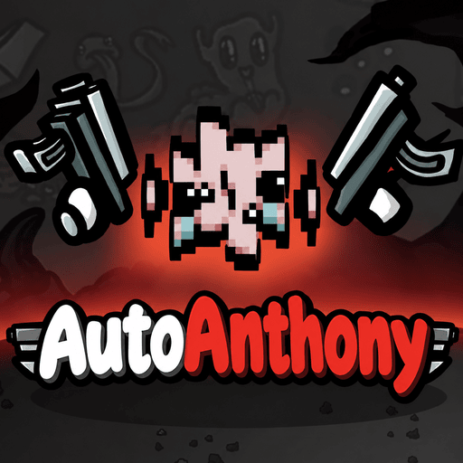
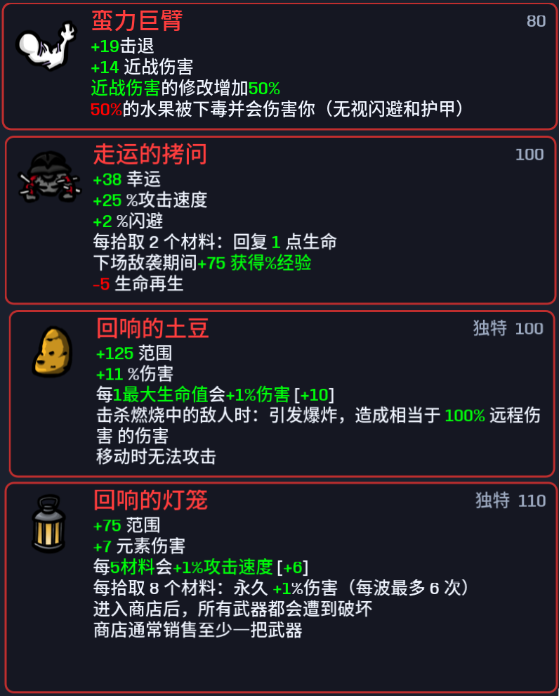
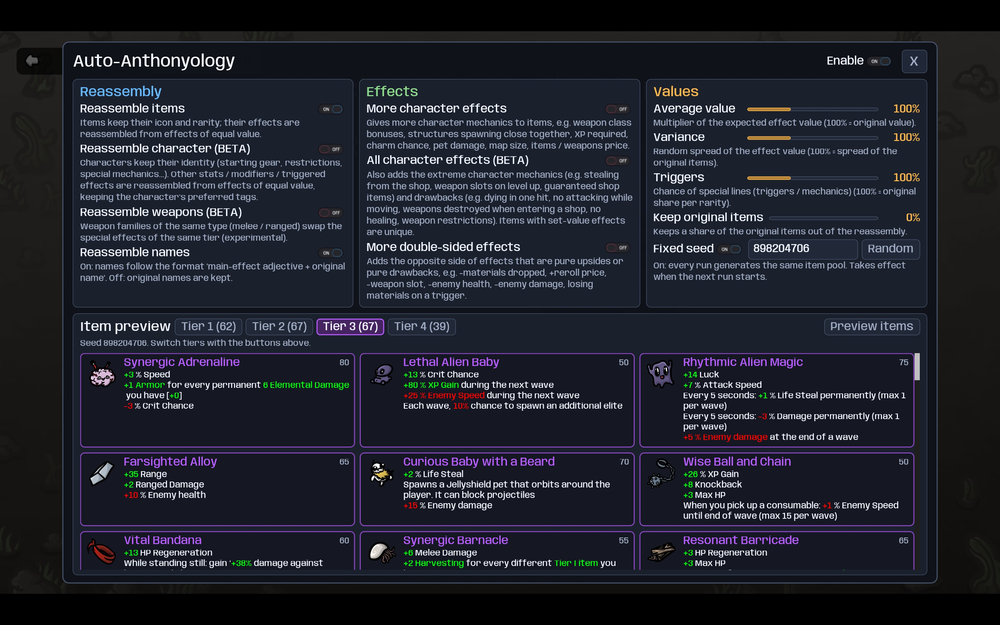
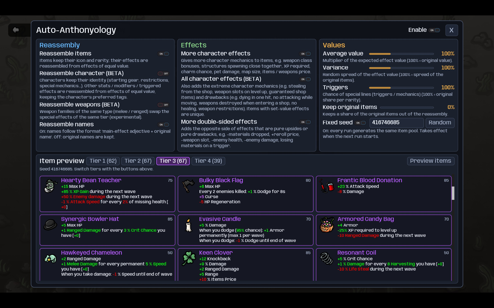
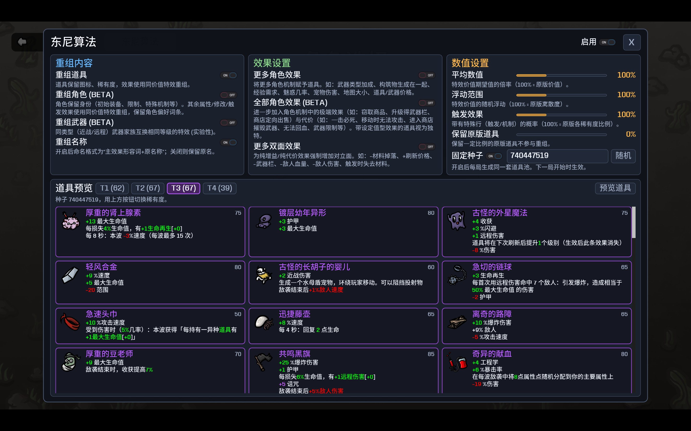
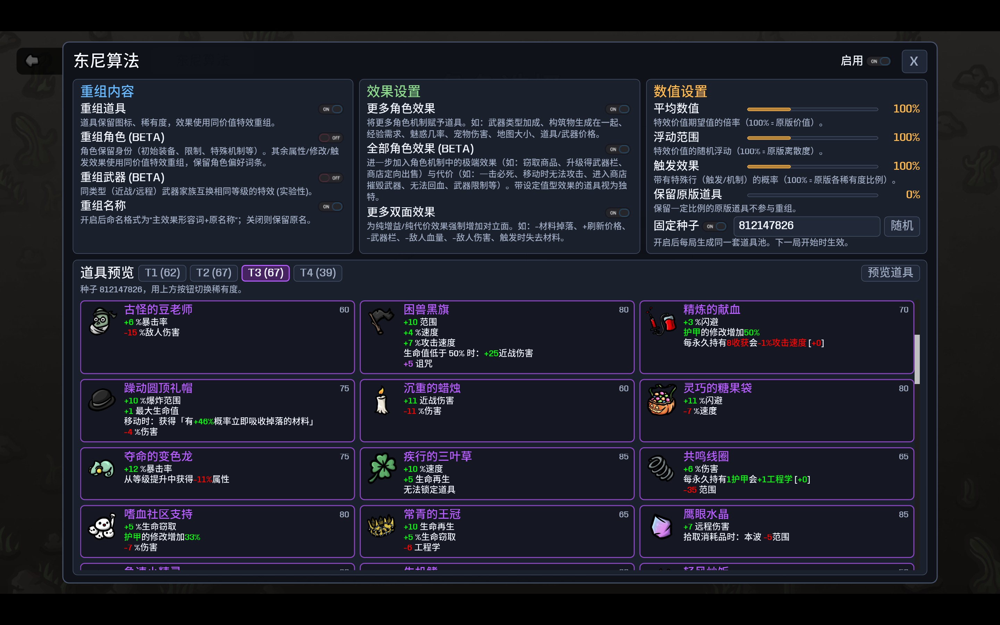

# BrotatoMods

A collection of mods for the game [Brotato](https://store.steampowered.com/app/1942280/Brotato/).

## [Double Sided Upgrades](Mojimoon-DoubleSidedUpgrades)

[Steam Workshop](https://steamcommunity.com/sharedfiles/filedetails/?id=3671945570) | [Open in Steam Client](https://link.steam.watch/url/CommunityFilePage/3671945570)

> Cursed & Double Sided Upgrades / 诅咒和双面升级

Have you ever thought about the upgrades in Brotato being a bit too fixed? Then this mod is for you! It introduces the **cursed** and **double-sided** upgrade system and **configurable upgrades effect** strength. **And now supports co-op!**

### What does it do?

- 50% of the upgrades will be double-sided, meaning they will have both a positive and a negative effect. The positive effect will be +200% of the original stat increase, while the negative effect will be -100% of another stat. For example, the T4 damage upgrade usually gives you +16% damage, but with this mod, you can now choose a double-sided upgrade that gives you +32% damage but -60 range.
- If DLC Abyssal Terrors is installed, upgrades share the same chance to be cursed as other items, which increases the positive effect and reduces the negative effect (if any).

### Mod Options

By subscribing to [dami-ModOptions](https://steamcommunity.com/sharedfiles/filedetails/?id=2944608034) (you can find it on the right sidebar), you can configure the following settings in-game (this is not required if you are fine with the default settings):

- DOUBLE_SIDED_UPGRADES_CHANCE: the chance for an upgrade to be double-sided (default: 50%)
- GLOBAL_UPGRADE_MULT: the global multiplier for all upgrade effects. Stacks multiplicatively with the following two multipliers (default: 100%)
- POSITIVE_UPGRADE_MULT: the multiplier for the positive effect of double-sided upgrades (default: 200%)
- NEGATIVE_UPGRADE_MULT: the multiplier for the negative effect of double-sided upgrades (default: -100%)
- CURSED_UPGRADE: enable cursed upgrades. Only works if you have DLC Abyssal Terrors installed (default: true)
- FORCE_CURSED_UPGRADE: force all upgrades to be cursed. Only works if CURSED_UPGRADE is enabled (default: false)

### Try it out!

There are many fun ways to play with these settings. If you are a masochist, try -100% Mutant and see your stats weaken as you level up! If you want to be overpowered, check out +500% Baby and see how crazy it is to get 5 weapon slots from one upgrade!

If you like this mod, please consider liking, favoriting and sharing it, thank you! Comments and suggestions are also very welcome!

<!-- BBCode

Have you ever thought about the upgrades in Brotato being a bit too fixed? Then this mod is for you! It introduces the [b]cursed[/b] and [b]double-sided[/b] upgrade system and [b]configurable upgrades effect[/b] strength. [pullquote]And now supports co-op![/pullquote]

[h1]What does it do?[/h1]

[list]
[*]50% of the upgrades will be double-sided, meaning they will have both a positive and a negative effect. The positive effect will be +200% of the original stat increase, while the negative effect will be -100% of another stat. For example, the T4 damage upgrade usually gives you +16% damage, but with this mod, you can now choose a double-sided upgrade that gives you +32% damage but -60 range.
[*]If DLC Abyssal Terrors is installed, upgrades share the same chance to be cursed as other items, which increases the positive effect and reduces the negative effect (if any).
[/list]

[h1]Mod Options[/h1]
By subscribing to [url=https://steamcommunity.com/sharedfiles/filedetails/?id=2944608034]dami-ModOptions[/url] (you can find it on the right sidebar), you can configure the following settings in-game (this is not required if you are fine with the default settings):

[list]
[*]DOUBLE_SIDED_UPGRADES_CHANCE: the chance for an upgrade to be double-sided (default: 50%)
[*]GLOBAL_UPGRADE_MULT: the global multiplier for all upgrade effects. Stacks multiplicatively with the following two multipliers (default: 100%)
[*]POSITIVE_UPGRADE_MULT: the multiplier for the positive effect of double-sided upgrades (default: 200%)
[*]NEGATIVE_UPGRADE_MULT: the multiplier for the negative effect of double-sided upgrades (default: -100%)
[*]CURSED_UPGRADE: enable cursed upgrades. Only works if you have DLC Abyssal Terrors installed (default: true)
[*]FORCE_CURSED_UPGRADE: force all upgrades to be cursed. Only works if CURSED_UPGRADE is enabled (default: false)
[/list]

[h1]Try it out![/h1]

There are many fun ways to play with these settings. If you are a masochist, try -100% Mutant and see your stats weaken as you level up! If you want to be overpowered, check out +500% Baby and see how crazy it is to get 5 weapon slots from one upgrade!

[pullquote]If you like this mod, please consider liking, favoriting and sharing it, thank you! Comments and suggestions are also very welcome![/pullquote]

[img]https://images.steamusercontent.com/ugc/44567523600397314/6B6642339A9CBFF3E081B3CC347F70D6EFD2F0D7/[/img]

GitHub repo: [url=https://github.com/mojimoon/BrotatoMods]mojimoon/BrotatoMods[/url]

-->

---

你是否觉得Brotato中的升级有点过于固定了？那你可找对地方了！这个 mod 引入了 **诅咒** 和 **双面** 升级系统，以及 **可自定义的升级效果** 强度。**现已支持合作模式！**

### 干什么的？

- 50% 的升级会变成双面升级，拥有一个正面效果和一个负面效果。正面效果会增加 200% 的原属性，而负面效果会减少 100% 的另一个主属性。例如，T4 的伤害升级是 +16% 伤害，但有了这个 mod，你现在可以选择一个双面升级，获得 +32% 伤害但 -60 范围。
- 如果你有 DLC 深海魔怪，升级和其他物品有同样的几率被诅咒，增强正面效果并减少负面效果。

### Mod Options

通过订阅 [dami-ModOptions](https://steamcommunity.com/sharedfiles/filedetails/?id=2944608034)（可以在页面右侧找到），你可以在游戏中配置以下设置（如果你对默认设置满意的话，这不是必需的）：

- DOUBLE_SIDED_UPGRADES_CHANCE：升级变成双面升级的概率（默认：50%）
- GLOBAL_UPGRADE_MULT：所有升级效果的倍率。和下面两个叠乘（默认：100%）
- POSITIVE_UPGRADE_MULT：双面升级中正面效果的倍率（默认：200%）
- NEGATIVE_UPGRADE_MULT：双面升级中负面效果的倍率（默认：-100%）
- CURSED_UPGRADE：允许升级被诅咒。只有在你安装了 DLC 深海魔怪的情况下才有效（默认：true）
- FORCE_CURSED_UPGRADE：强制所有升级都被诅咒。只有在启用 CURSED_UPGRADE 的情况下才有效（默认：false）

### 来试试吧！

有很多有趣的玩法可以尝试。如果你是个抖M，不妨试试 -100% 异变体，看看全红的升级好不好受。或者如果你想要一些乐子，试试 +500% 宝宝，看看升级一次拿 5 个武器栏有多爽！

如果你喜欢这个 mod，欢迎点赞、收藏、转发，多谢啦！有问题或建议欢迎在评论区留言！

<!-- BBCode

你是否觉得Brotato中的升级有点过于固定了？那你可找对地方了！这个 mod 引入了 [b]诅咒[/b] 和 [b]双面[/b] 升级系统，以及 [b]可自定义的升级效果[/b] 强度。[pullquote]现已支持合作模式！[/pullquote]

[h1]干什么的？[/h1]

[list]
[*]50% 的升级会变成双面升级，拥有一个正面效果和一个负面效果。正面效果会增加 200% 的原属性，而负面效果会减少 100% 的另一个主属性。例如，T4 的伤害升级是 +16% 伤害，但有了这个 mod，你现在可以选择一个双面升级，获得 +32% 伤害但 -60 范围。
[*]如果你有 DLC 深海魔怪，升级和其他物品有同样的几率被诅咒，增强正面效果并减少负面效果。
[/list]

[h1]Mod Options[/h1]

通过订阅 [url=https://steamcommunity.com/sharedfiles/filedetails/?id=2944608034]dami-ModOptions[/url]（可以在页面右侧找到），你可以在游戏中配置以下设置（如果你对默认设置满意的话，这不是必需的）：

[list]
[*]DOUBLE_SIDED_UPGRADES_CHANCE：升级变成双面升级的概率（默认：50%）
[*]GLOBAL_UPGRADE_MULT：所有升级效果的倍率。和下面两个叠乘（默认：100%）
[*]POSITIVE_UPGRADE_MULT：双面升级中正面效果的倍率（默认：200%）
[*]NEGATIVE_UPGRADE_MULT：双面升级中负面效果的倍率（默认：-100%）
[*]CURSED_UPGRADE：允许升级被诅咒。只有在你安装了 DLC 深海魔怪的情况下才有效（默认：true）
[*]FORCE_CURSED_UPGRADE：强制所有升级都被诅咒。只有在启用 CURSED_UPGRADE 的情况下才有效（默认：false）
[/list]

[h1]来试试吧！[/h1]

有很多有趣的玩法可以尝试。如果你是个抖M，不妨试试 -100% 异变体，看看全红的升级好不好受。或者如果你想要一些乐子，试试 +500% 宝宝，看看升级一次拿 5 个武器栏有多爽！

[pullquote]如果你喜欢这个 mod，欢迎点赞、收藏、转发，多谢啦！有问题或建议欢迎在评论区留言！[/pullquote]

[img]https://images.steamusercontent.com/ugc/44567523600397314/6B6642339A9CBFF3E081B3CC347F70D6EFD2F0D7/[/img]

GitHub 仓库：[url=https://github.com/mojimoon/BrotatoMods]mojimoon/BrotatoMods[/url]

--->

Screenshots

## [One Item to Rule Them All v2](Mojimoon-OneItemToRuleThemAllv2)

[Steam Workshop](https://steamcommunity.com/sharedfiles/filedetails/?id=3808638762) | [Open in Steam Client](https://link.steam.watch/url/CommunityFilePage/3808638762)

> One Item to Rule Them All v2 / 假如所有道具变成

**What if every item turned into a Potato, a Gentle Alien, a Candy Bag...?** This mod is all you need: One Item to Rule Them All.

**Now with a major upgrade**: a brand-new UI, better UX, three side-by-side replacement pools (shop, crates, T4 crates), and settings import/export!

### How to use

After picking a character, click **Replace Items** in the top-left corner of the character/weapon/difficulty selection screen. Pick the items you want from the list, then start the run. That's it!

### Features

- **Round-robin rotation**: pick several items and they take turns (e.g., A-B-A-B), in the order you chose them.
- **Separate pools**: shops, crates and T4 crates each get their own items, or replace only the first few crates.
- **Import / export**: share your whole setup as a code through the clipboard.
- **Detailed yet intuitive UI**: item search, rarity colors, numbered pools, and a live description of exactly what will be replaced.
- **Full language support**: English, Français, 简体中文, 日本語, 한국어, 繁體中文, Русский, Polski, Español, Português, Deutsch, Türkçe, Italiano.

### Options

**Enable** (default: **on**): the master switch. When it's off, nothing is replaced and your settings are kept.

**Curse** (default: off): replaced items are always cursed (random strength that grows with the wave, just like naturally cursed items). *Requires the Abyssal Terrors DLC*.

Even when it's off, a curse on the original item carries over to its replacement.

The three cards each have their own replacement pool.

**Shop**

| Option | Default | What it does |
| --- | --- | --- |
| Starting items | Off | Your character's starting items (the character itself and weapons are untouched). |
| All items in shop | **On** | Every item slot in the shop (weapons are untouched). |
| Shops always sell | Off | Upon each shop reroll, one of the slots is guaranteed to be one of the selected items. |
| Sold once per wave | Off | Each wave, the shop will sell all of the selected items once, then back to random. |

"All items in shop", "Shops always sell" and "Sold once per wave" are mutually exclusive, at most one of them can be enabled.

**Crate / T4 Crate**

Crates (including the extra items from treasure maps) and T4 crates are configured separately, each with four modes:

| Mode | What it does |
| --- | --- |
| Off | Still generated randomly. |
| Shop | Use the Shop pool. |
| Independent | Use the card's own pool, rotating A-B-A-B. |
| One-time | The first N crates become your N items, in order. After that, back to random. |

Defaults: Crate = **Shop**, T4 Crate = **Off**.

**Import / Export**

The **Import settings** and **Export settings** buttons at the top copy all of your settings to the clipboard as a share code, or load them back from it. Handy for sharing a setup with friends.

### Try these combos

Content creators on Bilibili have already come up with plenty of fun combos (videos in Chinese):

- [Loud + Gentle Alien](https://www.bilibili.com/video/BV1XHhZ6wEwJ/): more enemies, more materials; more materials, more enemies
- [Jack + Candy Bag](https://www.bilibili.com/video/BV1jeag6kEDy/): snowball your stats and grab red items for free
- [Demon + Potato](https://www.bilibili.com/video/BV1VDhb6SEbd/): just stats
- [Cryptid + Tree](https://www.bilibili.com/video/BV1vUaZ6qEAC/): survival and economy is all you need

Got a fun combo of your own? Post a video or share it in the comments!

Note: this is an entirely different mod. **Do not enable v1 and v2 at the same time.**

<!-- BBCode

[b]What if every item turned into a Potato, a Gentle Alien, a Candy Bag...?[/b] This mod is all you need: One Item to Rule Them All.

[b]Now with a major upgrade[/b]: a brand-new UI, better UX, three side-by-side replacement pools (shop, crates, T4 crates), and settings import/export!

[h1]How to use[/h1]

After picking a character, click [b]Replace Items[/b] in the top-left corner of the character/weapon/difficulty selection screen. Pick the items you want from the list, then start the run. That's it!

[h1]Features[/h1]

[list]
[*][b]Round-robin rotation[/b]: pick several items and they take turns (e.g., A-B-A-B), in the order you chose them.
[*][b]Separate pools[/b]: shops, crates and T4 crates each get their own items, or replace only the first few crates.
[*][b]Import / export[/b]: share your whole setup as a code through the clipboard.
[*][b]Detailed yet intuitive UI[/b]: item search, rarity colors, numbered pools, and a live description of exactly what will be replaced.
[*][b]Full language support[/b]: English, Français, 简体中文, 日本語, 한국어, 繁體中文, Русский, Polski, Español, Português, Deutsch, Türkçe, Italiano.
[/list]

[h1]Options[/h1]

[b]Enable[/b] (default: [b]on[/b]): the master switch. When it's off, nothing is replaced and your settings are kept.

[b]Curse[/b] (default: off): replaced items are always cursed (random strength that grows with the wave, just like naturally cursed items). [i]Requires the Abyssal Terrors DLC[/i].

Even when it's off, a curse on the original item carries over to its replacement.

The three cards each have their own replacement pool.

[h2]Shop[/h2]

[table]
[tr][th]Option[/th][th]Default[/th][th]What it does[/th][/tr]
[tr][td]Starting items[/td][td]Off[/td][td]Your character's starting items (the character itself and weapons are untouched).[/td][/tr]
[tr][td]All items in shop[/td][td][b]On[/b][/td][td]Every item slot in the shop (weapons are untouched).[/td][/tr]
[tr][td]Shops always sell[/td][td]Off[/td][td]Upon each shop reroll, one of the slots is guaranteed to be one of the selected items.[/td][/tr]
[tr][td]Sold once per wave[/td][td]Off[/td][td]Each wave, the shop will sell all of the selected items once, then back to random.[/td][/tr]
[/table]

"All items in shop", "Shops always sell" and "Sold once per wave" are mutually exclusive, at most one of them can be enabled.

[h2]Crate / T4 Crate[/h2]

Crates (including the extra items from treasure maps) and T4 crates are configured separately, each with four modes:

[table]
[tr][th]Mode[/th][th]What it does[/th][/tr]
[tr][td]Off[/td][td]Still generated randomly.[/td][/tr]
[tr][td]Shop[/td][td]Use the Shop pool.[/td][/tr]
[tr][td]Independent[/td][td]Use the card's own pool, rotating A-B-A-B.[/td][/tr]
[tr][td]One-time[/td][td]The first N crates become your N items, in order. After that, back to random.[/td][/tr]
[/table]

Defaults: Crate = [b]Shop[/b], T4 Crate = [b]Off[/b].

[h2]Import / Export[/h2]

The [b]Import settings[/b] and [b]Export settings[/b] buttons at the top copy all of your settings to the clipboard as a share code, or load them back from it. Handy for sharing a setup with friends.

[h1]Try these combos[/h1]

Content creators on Bilibili have already come up with plenty of fun combos (videos in Chinese):

[list]
[*][url=https://www.bilibili.com/video/BV1XHhZ6wEwJ/]Loud + Gentle Alien[/url]: more enemies, more materials; more materials, more enemies
[*][url=https://www.bilibili.com/video/BV1jeag6kEDy/]Jack + Candy Bag[/url]: snowball your stats and grab red items for free
[*][url=https://www.bilibili.com/video/BV1VDhb6SEbd/]Demon + Potato[/url]: just stats
[*][url=https://www.bilibili.com/video/BV1vUaZ6qEAC/]Cryptid + Tree[/url]: survival and economy is all you need
[/list]

Got a fun combo of your own? Post a video or share it in the comments!

Note: this is an entirely different mod. [pullquote]Do not enable v1 and v2 at the same time.[/pullquote]

[pullquote]If you like this mod, please consider liking, favoriting and sharing it, thank you! Comments and suggestions are also very welcome![/pullquote]

[img]https://images.steamusercontent.com/ugc/44567523600397314/6B6642339A9CBFF3E081B3CC347F70D6EFD2F0D7/[/img]

GitHub repo: [url=https://github.com/mojimoon/BrotatoMods]mojimoon/BrotatoMods[/url]

-->

---

**假如所有道具变成土豆、外星绅士、糖果袋……** 你只需要这个 mod，One Item to Rule Them All。

**现已迎来重大升级**，全新 UI、交互优化，商店、箱子、T4 箱子三个替换池并排显示，还能导入导出设置！

### 如何使用

选择角色后，在角色/武器/难度选择界面左上角点击 **替换物品**。在物品列表中选择想要替换的物品，然后开始游戏。就这么简单！

### 特色

- **A-B-A-B 轮流替换**：选多件物品时，按选择顺序轮流出现。
- **独立替换池**：商店、箱子、T4 箱子各自指定物品，或者只替换前几个箱子。
- **导入 / 导出**：通过剪贴板分享整套设置。
- **详细又直观的 UI**：搜索道具、稀有度底色、带序号的替换池，还会实时告诉你哪些东西会被替换。
- **全语言支持**：English、Français、简体中文、日本語、한국어、繁體中文、Русский、Polski、Español、Português、Deutsch、Türkçe、Italiano。

### 选项说明

**启用**（默认：**开**）：总开关。关闭后不做任何替换，设置保留。

**诅咒**（默认：关）：替换后的物品固定被诅咒（强度随机并随波次提升，和游戏里自然出现的诅咒物品一致）。*需要深海魔怪 DLC*。

即使关闭，原物品被诅咒时，也会传递到替换后的物品上。

三张卡片各自拥有独立的替换池。

**商店**

| 选项 | 默认 | 作用 |
| --- | --- | --- |
| 起始物品 | 关 | 角色开局自带的物品（不含角色本身和武器）。 |
| 所有商店物品 | **开** | 商店里的所有物品槽位（不含武器）。 |
| 商店通常销售 | 关 | 每次商店刷新时，固定有一个槽位是所选物品之一。 |
| 每波销售一次 | 关 | 每波商店固定销售所选的所有物品各一次，这之后恢复随机。 |

“所有商店物品”、“商店通常销售”和“每波销售一次”互斥，最多只能启用其中一个。

**箱子 / T4箱子**

箱子（含藏宝图的额外物品）和 T4 箱子分别设置，各有四种模式：

| 模式 | 作用 |
| --- | --- |
| 禁用 | 仍然随机生成。 |
| 商店 | 使用商店的替换池。 |
| 独立 | 使用该卡片自己的替换池，A-B-A-B 轮流替换。 |
| 单次 | 前 N 个箱子按顺序变成你选的 N 件物品，之后恢复随机。 |

默认值：箱子 = **商店**，T4 箱子 = **禁用**。

**导入 / 导出**

顶部的 **导入设置** 和 **导出设置** 按钮可以把全部设置作为分享码复制到剪贴板，或从剪贴板读取。方便和朋友分享配置。

### 试试这些组合

B 站 UP 主们已经做了很多有趣的组合，欢迎参考：

- [大嗓门 + 外星绅士](https://www.bilibili.com/video/BV1XHhZ6wEwJ/)：怪物越多经济越多，经济越多怪物越多
- [杰克 + 糖果袋](https://www.bilibili.com/video/BV1jeag6kEDy/)：滚雪球还能白嫖红色道具
- [恶魔 + 土豆](https://www.bilibili.com/video/BV1VDhb6SEbd/)：纯粹的数值
- [神秘生物 + 树](https://www.bilibili.com/video/BV1vUaZ6qEAC/)：生存经济两手抓

你也有好玩的组合？欢迎发视频或分享到评论区！

注意：这是一个全新的 mod，**请不要同时启用 v1 和 v2**。

<!-- BBCode

[b]假如所有道具变成土豆、外星绅士、糖果袋……[/b] 你只需要这个 mod，One Item to Rule Them All。

[b]现已迎来重大升级[/b]，全新 UI、交互优化，商店、箱子、T4 箱子三个替换池并排显示，还能导入导出设置！

[h1]如何使用[/h1]

选择角色后，在角色/武器/难度选择界面左上角点击 [b]替换物品[/b]。在物品列表中选择想要替换的物品，然后开始游戏。就这么简单！

[h1]特色[/h1]

[list]
[*][b]A-B-A-B 轮流替换[/b]：选多件物品时，按选择顺序轮流出现。
[*][b]独立替换池[/b]：商店、箱子、T4 箱子各自指定物品，或者只替换前几个箱子。
[*][b]导入 / 导出[/b]：通过剪贴板分享整套设置。
[*][b]详细又直观的 UI[/b]：搜索道具、稀有度底色、带序号的替换池，还会实时告诉你哪些东西会被替换。
[*][b]全语言支持[/b]：English、Français、简体中文、日本語、한국어、繁體中文、Русский、Polski、Español、Português、Deutsch、Türkçe、Italiano。
[/list]

[h1]选项说明[/h1]

[b]启用[/b]（默认：[b]开[/b]）：总开关。关闭后不做任何替换，设置保留。

[b]诅咒[/b]（默认：关）：替换后的物品固定被诅咒（强度随机并随波次提升，和游戏里自然出现的诅咒物品一致）。[i]需要深海魔怪 DLC[/i]。

即使关闭，原物品被诅咒时，也会传递到替换后的物品上。

三张卡片各自拥有独立的替换池。

[h2]商店[/h2]

[table]
[tr][th]选项[/th][th]默认[/th][th]作用[/th][/tr]
[tr][td]起始物品[/td][td]关[/td][td]角色开局自带的物品（不含角色本身和武器）。[/td][/tr]
[tr][td]所有商店物品[/td][td][b]开[/b][/td][td]商店里的所有物品槽位（不含武器）。[/td][/tr]
[tr][td]商店通常销售[/td][td]关[/td][td]每次商店刷新时，固定有一个槽位是所选物品之一。[/td][/tr]
[tr][td]每波销售一次[/td][td]关[/td][td]每波商店固定销售所选的所有物品各一次，这之后恢复随机。[/td][/tr]
[/table]

“所有商店物品”、“商店通常销售”和“每波销售一次”互斥，最多只能启用其中一个。

[h2]箱子 / T4箱子[/h2]

箱子（含藏宝图的额外物品）和 T4 箱子分别设置，各有四种模式：

[table]
[tr][th]模式[/th][th]作用[/th][/tr]
[tr][td]禁用[/td][td]仍然随机生成。[/td][/tr]
[tr][td]商店[/td][td]使用商店的替换池。[/td][/tr]
[tr][td]独立[/td][td]使用该卡片自己的替换池，A-B-A-B 轮流替换。[/td][/tr]
[tr][td]单次[/td][td]前 N 个箱子按顺序变成你选的 N 件物品，之后恢复随机。[/td][/tr]
[/table]

默认值：箱子 = [b]商店[/b]，T4 箱子 = [b]禁用[/b]。

[h2]导入 / 导出[/h2]

顶部的 [b]导入设置[/b] 和 [b]导出设置[/b] 按钮可以把全部设置作为分享码复制到剪贴板，或从剪贴板读取。方便和朋友分享配置。

[h1]试试这些组合[/h1]

B 站 UP 主们已经做了很多有趣的组合，欢迎参考：

[list]
[*][url=https://www.bilibili.com/video/BV1XHhZ6wEwJ/]大嗓门 + 外星绅士[/url]：怪物越多经济越多，经济越多怪物越多
[*][url=https://www.bilibili.com/video/BV1jeag6kEDy/]杰克 + 糖果袋[/url]：滚雪球还能白嫖红色道具
[*][url=https://www.bilibili.com/video/BV1VDhb6SEbd/]恶魔 + 土豆[/url]：纯粹的数值
[*][url=https://www.bilibili.com/video/BV1vUaZ6qEAC/]神秘生物 + 树[/url]：生存经济两手抓
[/list]

你也有好玩的组合？欢迎发视频或分享到评论区！

注意：这是一个全新的 mod，[pullquote]请不要同时启用 v1 和 v2。[/pullquote]

[pullquote]如果你喜欢这个 mod，欢迎点赞、收藏、转发，多谢啦！有问题或建议欢迎在评论区留言！[/pullquote]

[img]https://images.steamusercontent.com/ugc/44567523600397314/6B6642339A9CBFF3E081B3CC347F70D6EFD2F0D7/[/img]

GitHub 仓库：[url=https://github.com/mojimoon/BrotatoMods]mojimoon/BrotatoMods[/url]

-->

Screenshots

<!--

假如所有道具变成 (One Item to Rule Them All v2)

假如所有道具都变成土豆、外星绅士、糖果袋……？装上这个 mod 就能实现！

v2 迎来重大升级：全新 UI、交互优化，商店、箱子、T4 箱子各有独立替换池，还能导入导出设置。开局前选好物品，商店和箱子里就只剩你选的那些。

B 站 UP 主们已经玩出了不少花样：大嗓门 + 外星绅士、杰克 + 糖果袋、恶魔 + 土豆……你也来试试？

创意工坊：https://steamcommunity.com/sharedfiles/filedetails/?id=3808638762

-->

## [Brotato: Auto-Anthonyology](Mojimoon-AutoAnthony)

[Steam Workshop](https://steamcommunity.com/sharedfiles/filedetails/?id=3671094202) | [Open in Steam Client](https://link.steam.watch/url/CommunityFilePage/3671094202)

> Brotato: Auto-Anthonyology / 土豆兄弟：东尼算法

**Every run, brand-new items and weapons.** Auto-Anthonyology breaks every item and weapon into its parts — stats, triggers, effects, mechanics — and puts them back together at random, at the same value. Same icons, same rarities, completely different items.

Inspired by the *Auto-Anthonyology* mod for Slay the Spire 2, which itself comes from Challenge #45 of The Binding of Isaac: Repentance. Many thanks to the original author!

### How to use

On the character, weapon or difficulty selection screen, click **Auto-Anthony** in the top-left corner (next to the back button). Pick your options, preview if you like, then start a run. The weapon selection screen already shows the reassembled weapons; going back to the main menu restores the original game.

### Features

- **Any trigger, any effect**: "when you dodge", "every 5 seconds", "the first time you hit an enemy with Elemental Damage"... paired with any effect: stats, healing, materials, explosions, "enemies take more damage", or another item's effect.
- **Fair values**: every effect is priced in materials, fitted on the original items; weapons are priced by their equivalent DPS. Every item is worth its price.
- **Feels like Brotato**: stat lines, downsides, special effects and weapon stats all follow the originals of the same rarity; key stats and the tags your character wants are always available.
- **Reassemble weapons**: new effects, or completely new stats, scaling and classes, with optional lower-tier versions and any starting weapon.
- **Easy to use and compatible**: the seed is saved with your run, cursed items work as usual, items from other mods are untouched.
- **Full language support**: English, Français, 简体中文, 日本語, 한국어, 繁體中文, Русский, Polski, Español, Português, Deutsch, Türkçe, Italiano.

### Options

**General**: **Enable** (default **on**) is the master switch; the **seed** can be fixed to get the same content every run; **Export / Import settings** shares all settings (including the seed) as a code through the clipboard.

The settings have three tabs. The switch on each tab turns that part on or off.

**Reassemble items** (default **on**)

| Option | Default | What it does |
| --- | --- | --- |
| More character effects | Off | Items can get more character mechanics (XP required, charm chance, map size, "when you hit an enemy with a damage type"...). |
| All character effects (BETA) | Off | Also extreme character mechanics (shop stealing, weapon slots on level up...) and drawbacks (dying in one hit, no healing...). |
| More double-sided effects | Off | Pure upsides / drawbacks get an opposite side (-materials dropped, -enemy health, losing materials on a trigger...). |
| Reassemble starting items | Off | Your character's starting items are reassembled too. |
| Keep original names | Off | Off: "adjective + original name". |
| Force reassembly (BETA) | Off | Spyglass, Bait, Pocket Factory, Axolotl, Goldfish and Fish Hook are reassembled too. |
| Chaos / Ultimate chaos | Off | Shuffle item rarities / rarities and icons (pick one). |
| Average value / Variance / Triggers | 100% / 100% / 125% | Overall strength, strength spread, and how often items have triggered or mechanic effects (100% = original). |
| Keep original items | 0% | Keeps a share of the original items. |

**Reassemble weapons** (default off)

| Option | Default | What it does |
| --- | --- | --- |
| Effects only / Deep reassembly | Deep | Effects only: weapons keep their stats and take a random weapon's effects. Deep: damage, scaling, cooldown, crit, projectiles, effects and classes are all rerolled. Melee / ranged is kept. |
| Item effects | **On** | Weapons may get a stat or effect from items. |
| Keep original names | Off | Off: "trait adjective + original name". |
| Complete lower tiers | Off | Weapons without lower tiers (Sword, Rocket Launcher, Excalibur...) get versions down to tier I. |
| Any starting weapon | **On** | Pick any weapon of your character's starting tier. |
| Average value / Variance / Extra effects | 100% / 100% / 125% | Overall strength, strength spread, and how many weapons have extra effects (100% = original). |

**Reassemble characters (BETA)** (default off): characters keep their identity (starting gear, restrictions, special mechanics); their other stats and effects are reassembled at equal value, favouring their preferred tags.

The **preview** under the item and weapon tabs lists everything for the current settings and seed, without starting a run.

If you like this mod, please consider liking, favoriting and sharing it, thank you! Comments and suggestions are also very welcome!

<!-- BBCode

[b]Every run, brand-new items and weapons.[/b] Auto-Anthonyology breaks every item and weapon into its parts — stats, triggers, effects, mechanics — and puts them back together at random, at the same value. Same icons, same rarities, completely different items.

Inspired by the [i]Auto-Anthonyology[/i] mod for Slay the Spire 2, which itself comes from Challenge #45 of The Binding of Isaac: Repentance. Many thanks to the original author!

[h1]How to use[/h1]

On the character, weapon or difficulty selection screen, click [b]Auto-Anthony[/b] in the top-left corner (next to the back button). Pick your options, preview if you like, then start a run. The weapon selection screen already shows the reassembled weapons; going back to the main menu restores the original game.

[h1]Features[/h1]

[list]
[*][b]Any trigger, any effect[/b]: "when you dodge", "every 5 seconds", "the first time you hit an enemy with Elemental Damage"... paired with any effect: stats, healing, materials, explosions, "enemies take more damage", or another item's effect.
[*][b]Fair values[/b]: every effect is priced in materials, fitted on the original items; weapons are priced by their equivalent DPS. Every item is worth its price.
[*][b]Feels like Brotato[/b]: stat lines, downsides, special effects and weapon stats all follow the originals of the same rarity; key stats and the tags your character wants are always available.
[*][b]Reassemble weapons[/b]: new effects, or completely new stats, scaling and classes, with optional lower-tier versions and any starting weapon.
[*][b]Easy to use and compatible[/b]: the seed is saved with your run, cursed items work as usual, items from other mods are untouched.
[*][b]Full language support[/b]: English, Français, 简体中文, 日本語, 한국어, 繁體中文, Русский, Polski, Español, Português, Deutsch, Türkçe, Italiano.
[/list]

[h1]Options[/h1]

[b]General[/b]: [b]Enable[/b] (default [b]on[/b]) is the master switch; the [b]seed[/b] can be fixed to get the same content every run; [b]Export / Import settings[/b] shares all settings (including the seed) as a code through the clipboard.

The settings have three tabs. The switch on each tab turns that part on or off.

[h2]Reassemble items (default on)[/h2]

[table]
[tr][th]Option[/th][th]Default[/th][th]What it does[/th][/tr]
[tr][td]More character effects[/td][td]Off[/td][td]Items can get more character mechanics (XP required, charm chance, map size, "when you hit an enemy with a damage type"...).[/td][/tr]
[tr][td]All character effects (BETA)[/td][td]Off[/td][td]Also extreme character mechanics (shop stealing, weapon slots on level up...) and drawbacks (dying in one hit, no healing...).[/td][/tr]
[tr][td]More double-sided effects[/td][td]Off[/td][td]Pure upsides / drawbacks get an opposite side (-materials dropped, -enemy health, losing materials on a trigger...).[/td][/tr]
[tr][td]Reassemble starting items[/td][td]Off[/td][td]Your character's starting items are reassembled too.[/td][/tr]
[tr][td]Keep original names[/td][td]Off[/td][td]Off: "adjective + original name".[/td][/tr]
[tr][td]Force reassembly (BETA)[/td][td]Off[/td][td]Spyglass, Bait, Pocket Factory, Axolotl, Goldfish and Fish Hook are reassembled too.[/td][/tr]
[tr][td]Chaos / Ultimate chaos[/td][td]Off[/td][td]Shuffle item rarities / rarities and icons (pick one).[/td][/tr]
[tr][td]Average value / Variance / Triggers[/td][td]100% / 100% / 125%[/td][td]Overall strength, strength spread, and how often items have triggered or mechanic effects (100% = original).[/td][/tr]
[tr][td]Keep original items[/td][td]0%[/td][td]Keeps a share of the original items.[/td][/tr]
[/table]

[h2]Reassemble weapons (default off)[/h2]

[table]
[tr][th]Option[/th][th]Default[/th][th]What it does[/th][/tr]
[tr][td]Effects only / Deep reassembly[/td][td]Deep[/td][td]Effects only: weapons keep their stats and take a random weapon's effects. Deep: damage, scaling, cooldown, crit, projectiles, effects and classes are all rerolled. Melee / ranged is kept.[/td][/tr]
[tr][td]Item effects[/td][td][b]On[/b][/td][td]Weapons may get a stat or effect from items.[/td][/tr]
[tr][td]Keep original names[/td][td]Off[/td][td]Off: "trait adjective + original name".[/td][/tr]
[tr][td]Complete lower tiers[/td][td]Off[/td][td]Weapons without lower tiers (Sword, Rocket Launcher, Excalibur...) get versions down to tier I.[/td][/tr]
[tr][td]Any starting weapon[/td][td][b]On[/b][/td][td]Pick any weapon of your character's starting tier.[/td][/tr]
[tr][td]Average value / Variance / Extra effects[/td][td]100% / 100% / 125%[/td][td]Overall strength, strength spread, and how many weapons have extra effects (100% = original).[/td][/tr]
[/table]

[b]Reassemble characters (BETA)[/b] (default off): characters keep their identity (starting gear, restrictions, special mechanics); their other stats and effects are reassembled at equal value, favouring their preferred tags.

The [b]preview[/b] under the item and weapon tabs lists everything for the current settings and seed, without starting a run.

[pullquote]If you like this mod, please consider liking, favoriting and sharing it, thank you! Comments and suggestions are also very welcome![/pullquote]

GitHub repo: [url=https://github.com/mojimoon/BrotatoMods]mojimoon/BrotatoMods[/url]

-->

---

**每一局，都是全新的道具和武器。** 东尼算法把每件道具和武器拆成零件——属性、触发条件、效果、机制——再按同等价值随机拼回去。图标和稀有度不变，内容却完全不同。

灵感来自《杀戮尖塔 2》的东尼算法（Auto-Anthonyology）mod，后者源于《以撒的结合：忏悔》中的挑战 45。在此向原作者致谢！

### 如何使用

在角色 / 武器 / 难度选择界面左上角（返回按钮旁）点击 **东尼算法**。选好设置，可以先预览，然后开始游戏。选择武器界面就会显示重组后的武器；回到主菜单后游戏自动还原。

### 特色

- **任意触发 × 任意效果**："闪避时""每 5 秒""首次用元素伤害命中敌人时"……可以搭配任意效果：属性、回血、材料、爆炸、"该敌人受到的伤害提高"，甚至是另一件道具的效果。
- **公平的数值**：每种效果都按材料计价，由原版道具拟合；武器按等效 DPS 计价。每件道具都值它的价格。
- **还是土豆兄弟的味道**：属性行数、代价、特殊效果、武器属性都跟随原版同稀有度；关键属性和角色想要的词条都保证存在。
- **重组武器**：换用新的效果，或者全新的属性、加成和武器类别；还可以补全低级武器、开局任选武器。
- **易用又兼容**：种子随存档保存；诅咒道具照常生效；其他 mod 添加的道具不受影响。
- **全语言支持**：English、Français、简体中文、日本語、한국어、繁體中文、Русский、Polski、Español、Português、Deutsch、Türkçe、Italiano。

### 选项说明

**通用**：**启用**（默认**开**）是总开关；**种子**可以固定，每局生成同样的内容；**导出 / 导入设置**通过剪贴板分享全部设置（含种子）。

设置分为三个页签，页签上的开关控制这一部分是否生效。

**重组道具**（默认**开**）

| 选项 | 默认 | 作用 |
| --- | --- | --- |
| 更多角色效果 | 关 | 道具可以获得更多角色机制（经验需求、魅惑几率、地图大小、"用某类伤害命中敌人时"……）。 |
| 全部角色效果 (BETA) | 关 | 进一步加入极端的角色机制（窃取商品、升级得武器栏……）与代价（一击必死、无法回血……）。 |
| 更多双面效果 | 关 | 为纯增益 / 纯代价效果加上对立面（-材料掉落、-敌人血量、触发时失去材料……）。 |
| 重组初始道具 | 关 | 角色的初始道具也参与重组。 |
| 保留原名 | 关 | 关闭时命名为"形容词+原名称"。 |
| 强制重组 (BETA) | 关 | 望远镜、诱饵、口袋工厂、蝾螈、金鱼、鱼钩也参与重组。 |
| 混沌 / 究极混沌 | 关 | 随机交换道具的稀有度 / 稀有度和图标（二选一）。 |
| 平均数值 / 浮动范围 / 触发效果 | 100% / 100% / 125% | 整体强度、强弱差异、带触发或机制效果的概率（100% = 原版）。 |
| 保留原版道具 | 0% | 保留一定比例的原版道具。 |

**重组武器**（默认关）

| 选项 | 默认 | 作用 |
| --- | --- | --- |
| 仅重组效果 / 深度重组 | 深度重组 | 仅重组效果：武器保留属性，换用随机武器的效果。深度重组：伤害、属性加成、冷却、暴击、投射物、效果和武器类别全部重新生成。近战 / 远程不变。 |
| 引入道具效果 | **开** | 武器可能获得来自道具的属性或效果。 |
| 保留原名 | 关 | 关闭时命名为"特征形容词+原名称"。 |
| 补全低级武器 | 关 | 原本没有低级版本的武器（剑、火箭筒、王者之剑……）补齐到 T1。 |
| 任意初始武器 | **开** | 开局可以选择角色初始稀有度的任意武器。 |
| 平均数值 / 浮动范围 / 额外效果 | 100% / 100% / 125% | 整体强度、强弱差异、有额外效果的武器数量（100% = 原版）。 |

**重组角色 (BETA)**（默认关）：角色保留身份（初始装备、限制、特殊机制），其余属性和效果按同等价值重组，偏向角色的偏好词条。

道具页与武器页下方的**预览**可以在开局前按当前设置与种子列出全部内容。

<!-- BBCode

[b]每一局，都是全新的道具和武器。[/b] 东尼算法把每件道具和武器拆成零件——属性、触发条件、效果、机制——再按同等价值随机拼回去。图标和稀有度不变，内容却完全不同。

灵感来自《杀戮尖塔 2》的东尼算法（Auto-Anthonyology）mod，后者源于《以撒的结合：忏悔》中的挑战 45。在此向原作者致谢！

[h1]如何使用[/h1]

在角色 / 武器 / 难度选择界面左上角（返回按钮旁）点击 [b]东尼算法[/b]。选好设置，可以先预览，然后开始游戏。选择武器界面就会显示重组后的武器；回到主菜单后游戏自动还原。

[h1]特色[/h1]

[list]
[*][b]任意触发 × 任意效果[/b]："闪避时""每 5 秒""首次用元素伤害命中敌人时"……可以搭配任意效果：属性、回血、材料、爆炸、"该敌人受到的伤害提高"，甚至是另一件道具的效果。
[*][b]公平的数值[/b]：每种效果都按材料计价，由原版道具拟合；武器按等效 DPS 计价。每件道具都值它的价格。
[*][b]还是土豆兄弟的味道[/b]：属性行数、代价、特殊效果、武器属性都跟随原版同稀有度；关键属性和角色想要的词条都保证存在。
[*][b]重组武器[/b]：换用新的效果，或者全新的属性、加成和武器类别；还可以补全低级武器、开局任选武器。
[*][b]易用又兼容[/b]：种子随存档保存；诅咒道具照常生效；其他 mod 添加的道具不受影响。
[*][b]全语言支持[/b]：English、Français、简体中文、日本語、한국어、繁體中文、Русский、Polski、Español、Português、Deutsch、Türkçe、Italiano。
[/list]

[h1]选项说明[/h1]

[b]通用[/b]：[b]启用[/b]（默认[b]开[/b]）是总开关；[b]种子[/b]可以固定，每局生成同样的内容；[b]导出 / 导入设置[/b]通过剪贴板分享全部设置（含种子）。

设置分为三个页签，页签上的开关控制这一部分是否生效。

[h2]重组道具（默认开）[/h2]

[table]
[tr][th]选项[/th][th]默认[/th][th]作用[/th][/tr]
[tr][td]更多角色效果[/td][td]关[/td][td]道具可以获得更多角色机制（经验需求、魅惑几率、地图大小、"用某类伤害命中敌人时"……）。[/td][/tr]
[tr][td]全部角色效果 (BETA)[/td][td]关[/td][td]进一步加入极端的角色机制（窃取商品、升级得武器栏……）与代价（一击必死、无法回血……）。[/td][/tr]
[tr][td]更多双面效果[/td][td]关[/td][td]为纯增益 / 纯代价效果加上对立面（-材料掉落、-敌人血量、触发时失去材料……）。[/td][/tr]
[tr][td]重组初始道具[/td][td]关[/td][td]角色的初始道具也参与重组。[/td][/tr]
[tr][td]保留原名[/td][td]关[/td][td]关闭时命名为"形容词+原名称"。[/td][/tr]
[tr][td]强制重组 (BETA)[/td][td]关[/td][td]望远镜、诱饵、口袋工厂、蝾螈、金鱼、鱼钩也参与重组。[/td][/tr]
[tr][td]混沌 / 究极混沌[/td][td]关[/td][td]随机交换道具的稀有度 / 稀有度和图标（二选一）。[/td][/tr]
[tr][td]平均数值 / 浮动范围 / 触发效果[/td][td]100% / 100% / 125%[/td][td]整体强度、强弱差异、带触发或机制效果的概率（100% = 原版）。[/td][/tr]
[tr][td]保留原版道具[/td][td]0%[/td][td]保留一定比例的原版道具。[/td][/tr]
[/table]

[h2]重组武器（默认关）[/h2]

[table]
[tr][th]选项[/th][th]默认[/th][th]作用[/th][/tr]
[tr][td]仅重组效果 / 深度重组[/td][td]深度重组[/td][td]仅重组效果：武器保留属性，换用随机武器的效果。深度重组：伤害、属性加成、冷却、暴击、投射物、效果和武器类别全部重新生成。近战 / 远程不变。[/td][/tr]
[tr][td]引入道具效果[/td][td][b]开[/b][/td][td]武器可能获得来自道具的属性或效果。[/td][/tr]
[tr][td]保留原名[/td][td]关[/td][td]关闭时命名为"特征形容词+原名称"。[/td][/tr]
[tr][td]补全低级武器[/td][td]关[/td][td]原本没有低级版本的武器（剑、火箭筒、王者之剑……）补齐到 T1。[/td][/tr]
[tr][td]任意初始武器[/td][td][b]开[/b][/td][td]开局可以选择角色初始稀有度的任意武器。[/td][/tr]
[tr][td]平均数值 / 浮动范围 / 额外效果[/td][td]100% / 100% / 125%[/td][td]整体强度、强弱差异、有额外效果的武器数量（100% = 原版）。[/td][/tr]
[/table]

[b]重组角色 (BETA)[/b]（默认关）：角色保留身份（初始装备、限制、特殊机制），其余属性和效果按同等价值重组，偏向角色的偏好词条。

道具页与武器页下方的[b]预览[/b]可以在开局前按当前设置与种子列出全部内容。

[pullquote]如果你喜欢这个 mod，欢迎点赞、收藏、转发，多谢啦！有问题或建议欢迎在评论区留言！[/pullquote]

GitHub 仓库：[url=https://github.com/mojimoon/BrotatoMods]mojimoon/BrotatoMods[/url]

-->

Screenshots

<!--

土豆兄弟：东尼算法 (Brotato: Auto-Anthonyology)

每一局，都是全新的道具和武器！东尼算法把每件道具和武器拆成属性、触发条件、效果和机制，再按同等价值随机拼回去：图标和稀有度不变，内容却完全不同。

"闪避时""首次用远程伤害击中敌人时""敌袭过半时"……任何触发条件都能搭配任何效果；数值按原版拟合，有千万种组合，还是熟悉的土豆兄弟手感。武器也能重组：换效果，或者伤害、加成、冷却、类别全部重新生成。想要更刺激的体验，还可以重组角色、加入一击必死和偷窃商店等角色机制、开启混沌打乱稀有度。

灵感来自《杀戮尖塔 2》的东尼算法 mod 与《以撒的结合：忏悔》挑战 45。快用分享码一键分享你的道具池！

创意工坊：https://steamcommunity.com/sharedfiles/filedetails/?id=3671094202

-->
