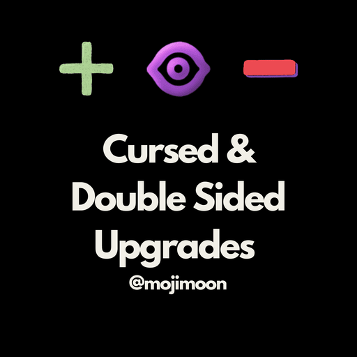
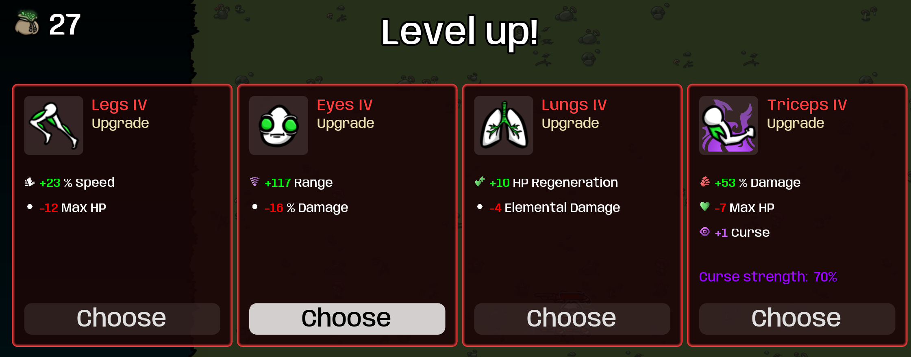
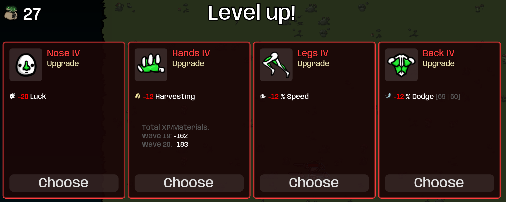
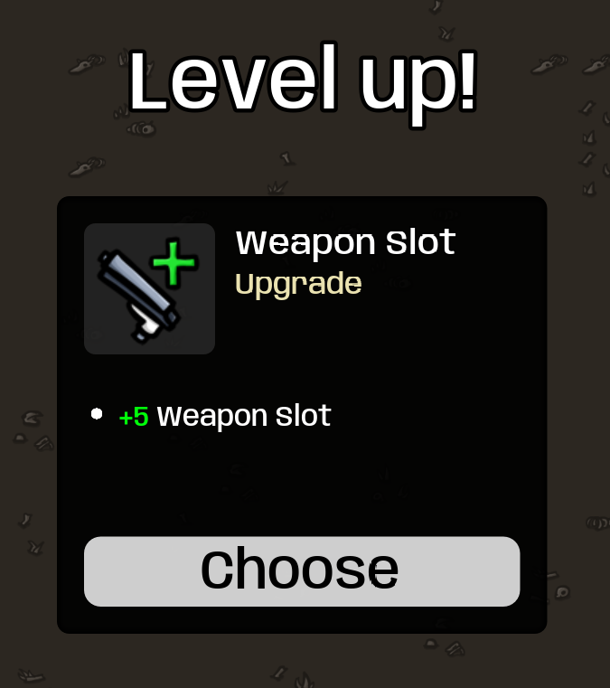
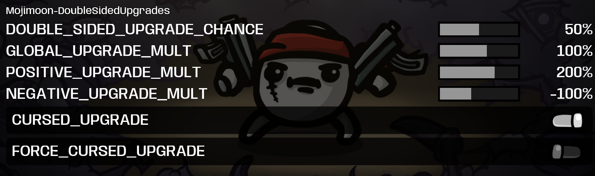
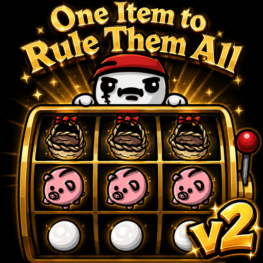
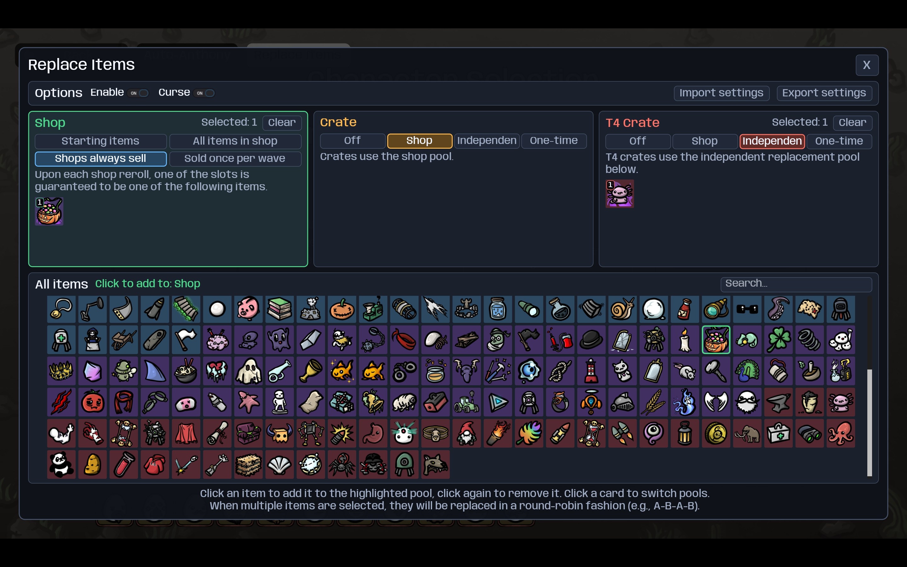
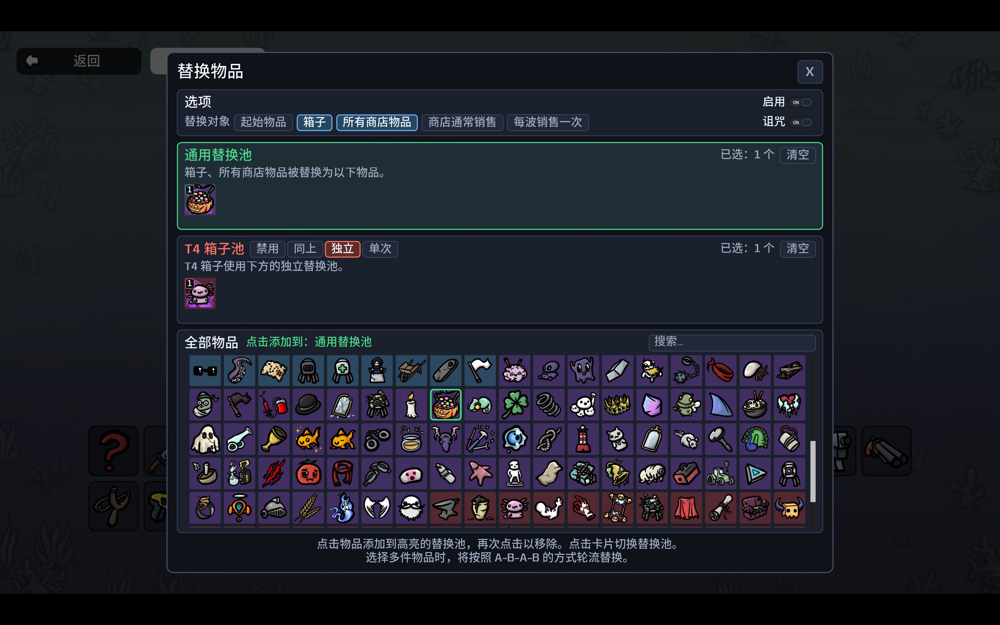
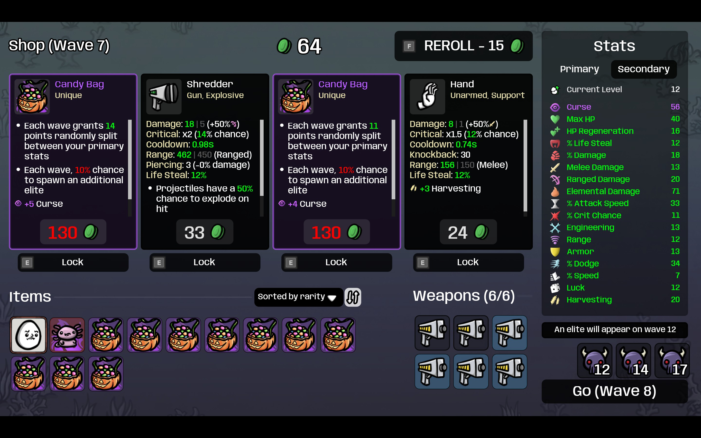

# BrotatoMods

A collection of mods for the game [Brotato](https://store.steampowered.com/app/1942280/Brotato/).

## [Double Sided Upgrades](Mojimoon-DoubleSidedUpgrades)

[Steam Workshop](https://steamcommunity.com/sharedfiles/filedetails/?id=3671945570) | [Open in Steam Client](https://link.steam.watch/url/CommunityFilePage/3671945570)

> Cursed & Double Sided Upgrades / 诅咒和双面升级

Have you ever thought about the upgrades in Brotato being a bit too fixed? Then this mod is for you! It introduces the **cursed** and **double-sided** upgrade system and **configurable upgrades effect** strength. **And now supports co-op!**

### What does it do?

- 50% of the upgrades will be double-sided, meaning they will have both a positive and a negative effect. The positive effect will be +200% of the original stat increase, while the negative effect will be -100% of another stat. For example, the T4 damage upgrade usually gives you +16% damage, but with this mod, you can now choose a double-sided upgrade that gives you +32% damage but -60 range.
- If DLC Abyssal Terrors is installed, upgrades share the same chance to be cursed as other items, which increases the positive effect and reduces the negative effect (if any).

### Mod Options

By subscribing to [dami-ModOptions](https://steamcommunity.com/sharedfiles/filedetails/?id=2944608034) (you can find it on the right sidebar), you can configure the following settings in-game (this is not required if you are fine with the default settings):

- DOUBLE_SIDED_UPGRADES_CHANCE: the chance for an upgrade to be double-sided (default: 50%)
- GLOBAL_UPGRADE_MULT: the global multiplier for all upgrade effects. Stacks multiplicatively with the following two multipliers (default: 100%)
- POSITIVE_UPGRADE_MULT: the multiplier for the positive effect of double-sided upgrades (default: 200%)
- NEGATIVE_UPGRADE_MULT: the multiplier for the negative effect of double-sided upgrades (default: -100%)
- CURSED_UPGRADE: enable cursed upgrades. Only works if you have DLC Abyssal Terrors installed (default: true)
- FORCE_CURSED_UPGRADE: force all upgrades to be cursed. Only works if CURSED_UPGRADE is enabled (default: false)

### Try it out!

There are many fun ways to play with these settings. If you are a masochist, try -100% Mutant and see your stats weaken as you level up! If you want to be overpowered, check out +500% Baby and see how crazy it is to get 5 weapon slots from one upgrade!

If you like this mod, please consider liking, favoriting and sharing it, thank you! Comments and suggestions are also very welcome!

<!-- BBCode

Have you ever thought about the upgrades in Brotato being a bit too fixed? Then this mod is for you! It introduces the [b]cursed[/b] and [b]double-sided[/b] upgrade system and [b]configurable upgrades effect[/b] strength. [pullquote]And now supports co-op![/pullquote]

[h1]What does it do?[/h1]

[list]
[*]50% of the upgrades will be double-sided, meaning they will have both a positive and a negative effect. The positive effect will be +200% of the original stat increase, while the negative effect will be -100% of another stat. For example, the T4 damage upgrade usually gives you +16% damage, but with this mod, you can now choose a double-sided upgrade that gives you +32% damage but -60 range.
[*]If DLC Abyssal Terrors is installed, upgrades share the same chance to be cursed as other items, which increases the positive effect and reduces the negative effect (if any).
[/list]

[h1]Mod Options[/h1]
By subscribing to [url=https://steamcommunity.com/sharedfiles/filedetails/?id=2944608034]dami-ModOptions[/url] (you can find it on the right sidebar), you can configure the following settings in-game (this is not required if you are fine with the default settings):

[list]
[*]DOUBLE_SIDED_UPGRADES_CHANCE: the chance for an upgrade to be double-sided (default: 50%)
[*]GLOBAL_UPGRADE_MULT: the global multiplier for all upgrade effects. Stacks multiplicatively with the following two multipliers (default: 100%)
[*]POSITIVE_UPGRADE_MULT: the multiplier for the positive effect of double-sided upgrades (default: 200%)
[*]NEGATIVE_UPGRADE_MULT: the multiplier for the negative effect of double-sided upgrades (default: -100%)
[*]CURSED_UPGRADE: enable cursed upgrades. Only works if you have DLC Abyssal Terrors installed (default: true)
[*]FORCE_CURSED_UPGRADE: force all upgrades to be cursed. Only works if CURSED_UPGRADE is enabled (default: false)
[/list]

[h1]Try it out![/h1]

There are many fun ways to play with these settings. If you are a masochist, try -100% Mutant and see your stats weaken as you level up! If you want to be overpowered, check out +500% Baby and see how crazy it is to get 5 weapon slots from one upgrade!

[pullquote]If you like this mod, please consider liking, favoriting and sharing it, thank you! Comments and suggestions are also very welcome![/pullquote]

[img]https://images.steamusercontent.com/ugc/44567523600397314/6B6642339A9CBFF3E081B3CC347F70D6EFD2F0D7/[/img]

GitHub repo: [url=https://github.com/mojimoon/BrotatoMods]mojimoon/BrotatoMods[/url]

-->

---

你是否觉得Brotato中的升级有点过于固定了？那你可找对地方了！这个 mod 引入了 **诅咒** 和 **双面** 升级系统，以及 **可自定义的升级效果** 强度。**现已支持合作模式！**

### 干什么的？

- 50% 的升级会变成双面升级，拥有一个正面效果和一个负面效果。正面效果会增加 200% 的原属性，而负面效果会减少 100% 的另一个主属性。例如，T4 的伤害升级是 +16% 伤害，但有了这个 mod，你现在可以选择一个双面升级，获得 +32% 伤害但 -60 范围。
- 如果你有 DLC 深海魔怪，升级和其他物品有同样的几率被诅咒，增强正面效果并减少负面效果。

### Mod Options

通过订阅 [dami-ModOptions](https://steamcommunity.com/sharedfiles/filedetails/?id=2944608034)（可以在页面右侧找到），你可以在游戏中配置以下设置（如果你对默认设置满意的话，这不是必需的）：

- DOUBLE_SIDED_UPGRADES_CHANCE：升级变成双面升级的概率（默认：50%）
- GLOBAL_UPGRADE_MULT：所有升级效果的倍率。和下面两个叠乘（默认：100%）
- POSITIVE_UPGRADE_MULT：双面升级中正面效果的倍率（默认：200%）
- NEGATIVE_UPGRADE_MULT：双面升级中负面效果的倍率（默认：-100%）
- CURSED_UPGRADE：允许升级被诅咒。只有在你安装了 DLC 深海魔怪的情况下才有效（默认：true）
- FORCE_CURSED_UPGRADE：强制所有升级都被诅咒。只有在启用 CURSED_UPGRADE 的情况下才有效（默认：false）

### 来试试吧！

有很多有趣的玩法可以尝试。如果你是个抖M，不妨试试 -100% 异变体，看看全红的升级好不好受。或者如果你想要一些乐子，试试 +500% 宝宝，看看升级一次拿 5 个武器栏有多爽！

如果你喜欢这个 mod，欢迎点赞、收藏、转发，多谢啦！有问题或建议欢迎在评论区留言！

<!-- BBCode

你是否觉得Brotato中的升级有点过于固定了？那你可找对地方了！这个 mod 引入了 [b]诅咒[/b] 和 [b]双面[/b] 升级系统，以及 [b]可自定义的升级效果[/b] 强度。[pullquote]现已支持合作模式！[/pullquote]

[h1]干什么的？[/h1]

[list]
[*]50% 的升级会变成双面升级，拥有一个正面效果和一个负面效果。正面效果会增加 200% 的原属性，而负面效果会减少 100% 的另一个主属性。例如，T4 的伤害升级是 +16% 伤害，但有了这个 mod，你现在可以选择一个双面升级，获得 +32% 伤害但 -60 范围。
[*]如果你有 DLC 深海魔怪，升级和其他物品有同样的几率被诅咒，增强正面效果并减少负面效果。
[/list]

[h1]Mod Options[/h1]

通过订阅 [url=https://steamcommunity.com/sharedfiles/filedetails/?id=2944608034]dami-ModOptions[/url]（可以在页面右侧找到），你可以在游戏中配置以下设置（如果你对默认设置满意的话，这不是必需的）：

[list]
[*]DOUBLE_SIDED_UPGRADES_CHANCE：升级变成双面升级的概率（默认：50%）
[*]GLOBAL_UPGRADE_MULT：所有升级效果的倍率。和下面两个叠乘（默认：100%）
[*]POSITIVE_UPGRADE_MULT：双面升级中正面效果的倍率（默认：200%）
[*]NEGATIVE_UPGRADE_MULT：双面升级中负面效果的倍率（默认：-100%）
[*]CURSED_UPGRADE：允许升级被诅咒。只有在你安装了 DLC 深海魔怪的情况下才有效（默认：true）
[*]FORCE_CURSED_UPGRADE：强制所有升级都被诅咒。只有在启用 CURSED_UPGRADE 的情况下才有效（默认：false）
[/list]

[h1]来试试吧！[/h1]

有很多有趣的玩法可以尝试。如果你是个抖M，不妨试试 -100% 异变体，看看全红的升级好不好受。或者如果你想要一些乐子，试试 +500% 宝宝，看看升级一次拿 5 个武器栏有多爽！

[pullquote]如果你喜欢这个 mod，欢迎点赞、收藏、转发，多谢啦！有问题或建议欢迎在评论区留言！[/pullquote]

[img]https://images.steamusercontent.com/ugc/44567523600397314/6B6642339A9CBFF3E081B3CC347F70D6EFD2F0D7/[/img]

GitHub 仓库：[url=https://github.com/mojimoon/BrotatoMods]mojimoon/BrotatoMods[/url]

--->

Screenshots

## [One Item to Rule Them All v2](Mojimoon-OneItemToRuleThemAllv2)

[Steam Workshop](https://steamcommunity.com/sharedfiles/filedetails/?id=3808638762) | [Open in Steam Client](https://link.steam.watch/url/CommunityFilePage/3808638762)

> One Item to Rule Them All v2 / 假如所有道具变成

**What if every item turned into a Potato, a Gentle Alien, a Candy Bag...?** This mod is all you need: One Item to Rule Them All.

**Now with a major upgrade**: a brand-new UI, better UX, and independent replacement for T4 crates!

### How to use

After picking a character, click **Replace Items** in the top-left corner of the weapon/difficulty selection screen. Pick the items you want from the list, then start the run. That's it!

### Features

- **Round-robin rotation**: pick several items and they take turns (e.g., A-B-A-B), in the order you chose them.
- **T4 Crate Pool**: give T4 crates their own items, or replace only the first few.
- **Detailed yet intuitive UI**: item search, rarity colors, numbered pools, and a live description of exactly what will be replaced.
- **Full language support**: English, Français, 简体中文, 日本語, 한국어, 繁體中文, Русский, Polski, Español, Português, Deutsch, Türkçe, Italiano.

### Options

**Enable** (default: **on**): the master switch. When it's off, nothing is replaced and your settings are kept.

**What to Replace**

| Option | Default | What it does |
| --- | --- | --- |
| Starting items | Off | Your character's starting items (the character itself and weapons are untouched). |
| Crates | **On** | Items from crates. |
| All items in shop | **On** | Every item slot in the shop (weapons are untouched). |
| Shops always sell | Off | Upon each shop reroll, one of the slots is guaranteed to be one of the selected items. |
| Sold once per wave | Off | Each wave, the shop will sell all of the selected items once, then back to random. |

"All items in shop", "Shops always sell" and "Sold once per wave" are mutually exclusive, at most one of them can be enabled.

**Curse** (default: off): replaced items are always cursed (random strength that grows with the wave, just like naturally cursed items). *Requires the Abyssal Terrors DLC*.

Even when it's off, a curse on the original item carries over to its replacement.

All of the above are replaced with items from the **General Replacement Pool**. You can also choose how T4 crates are replaced:

| Mode | T4 crates |
| --- | --- |
| Off (default) | Still generated randomly. |
| Same as above | Use the General Replacement Pool. |
| Independent | Use the Independent Replacement Pool, rotating A-B-A-B. |
| One-time | The first N T4 crates become your N items, in order. After that, back to random. |

### Try these combos

Content creators on Bilibili have already come up with plenty of fun combos (videos in Chinese):

- [Loud + Gentle Alien](https://www.bilibili.com/video/BV1XHhZ6wEwJ/): more enemies, more materials; more materials, more enemies
- [Jack + Candy Bag](https://www.bilibili.com/video/BV1jeag6kEDy/): snowball your stats and grab red items for free
- [Demon + Potato](https://www.bilibili.com/video/BV1VDhb6SEbd/): just stats

Got a fun combo of your own? Post a video or share it in the comments!

Note: this is an entirely different mod. **Do not enable v1 and v2 at the same time.**

<!-- BBCode

[b]What if every item turned into a Potato, a Gentle Alien, a Candy Bag...?[/b] This mod is all you need: One Item to Rule Them All.

[b]Now with a major upgrade[/b]: a brand-new UI, better UX, and independent replacement for T4 crates!

[h1]How to use[/h1]

After picking a character, click [b]Replace Items[/b] in the top-left corner of the weapon/difficulty selection screen. Pick the items you want from the list, then start the run. That's it!

[h1]Features[/h1]

[list]
[*][b]Round-robin rotation[/b]: pick several items and they take turns (e.g., A-B-A-B), in the order you chose them.
[*][b]T4 Crate Pool[/b]: give T4 crates their own items, or replace only the first few.
[*][b]Detailed yet intuitive UI[/b]: item search, rarity colors, numbered pools, and a live description of exactly what will be replaced.
[*][b]Full language support[/b]: English, Français, 简体中文, 日本語, 한국어, 繁體中文, Русский, Polski, Español, Português, Deutsch, Türkçe, Italiano.
[/list]

[h1]Options[/h1]

[b]Enable[/b] (default: [b]on[/b]): the master switch. When it's off, nothing is replaced and your settings are kept.

[h2]What to Replace[/h2]

[table]
[tr][th]Option[/th][th]Default[/th][th]What it does[/th][/tr]
[tr][td]Starting items[/td][td]Off[/td][td]Your character's starting items (the character itself and weapons are untouched).[/td][/tr]
[tr][td]Crates[/td][td][b]On[/b][/td][td]Items from crates.[/td][/tr]
[tr][td]All items in shop[/td][td][b]On[/b][/td][td]Every item slot in the shop (weapons are untouched).[/td][/tr]
[tr][td]Shops always sell[/td][td]Off[/td][td]Upon each shop reroll, one of the slots is guaranteed to be one of the selected items.[/td][/tr]
[tr][td]Sold once per wave[/td][td]Off[/td][td]Each wave, the shop will sell all of the selected items once, then back to random.[/td][/tr]
[/table]

"All items in shop", "Shops always sell" and "Sold once per wave" are mutually exclusive, at most one of them can be enabled.

[b]Curse[/b] (default: off): replaced items are always cursed (random strength that grows with the wave, just like naturally cursed items). [i]Requires the Abyssal Terrors DLC[/i].

Even when it's off, a curse on the original item carries over to its replacement.

All of the above are replaced with items from the [b]General Replacement Pool[/b]. You can also choose how T4 crates are replaced:

[table]
[tr][th]Mode[/th][th]T4 crates[/th][/tr]
[tr][td]Off (default)[/td][td]Still generated randomly.[/td][/tr]
[tr][td]Same as above[/td][td]Use the General Replacement Pool.[/td][/tr]
[tr][td]Independent[/td][td]Use the Independent Replacement Pool, rotating A-B-A-B.[/td][/tr]
[tr][td]One-time[/td][td]The first N T4 crates become your N items, in order. After that, back to random.[/td][/tr]
[/table]

[h1]Try these combos[/h1]

Content creators on Bilibili have already come up with plenty of fun combos (videos in Chinese):

[list]
[*][url=https://www.bilibili.com/video/BV1XHhZ6wEwJ/]Loud + Gentle Alien[/url]: more enemies, more materials; more materials, more enemies
[*][url=https://www.bilibili.com/video/BV1jeag6kEDy/]Jack + Candy Bag[/url]: snowball your stats and grab red items for free
[*][url=https://www.bilibili.com/video/BV1VDhb6SEbd/]Demon + Potato[/url]: just stats
[/list]

Got a fun combo of your own? Post a video or share it in the comments!

Note: this is an entirely different mod. [pullquote]Do not enable v1 and v2 at the same time.[/pullquote]

[pullquote]If you like this mod, please consider liking, favoriting and sharing it, thank you! Comments and suggestions are also very welcome![/pullquote]

[img]https://images.steamusercontent.com/ugc/44567523600397314/6B6642339A9CBFF3E081B3CC347F70D6EFD2F0D7/[/img]

GitHub repo: [url=https://github.com/mojimoon/BrotatoMods]mojimoon/BrotatoMods[/url]

-->

---

**假如所有道具变成土豆、外星绅士、糖果袋……** 你只需要这个 mod，One Item to Rule Them All。

**现已迎来重大升级**，全新 UI、交互优化、支持 T4 箱子独立替换！

### 如何使用

选择角色后，在武器/难度选择界面左上角点击 **替换物品**。在物品列表中选择想要替换的物品，然后开始游戏。就这么简单！

### 特色

- **A-B-A-B 轮流替换**：选多件物品时，按选择顺序轮流出现。
- **T4 箱子池**：给 T4 箱子单独指定物品，或者只替换前几个。
- **详细又直观的 UI**：搜索道具、稀有度底色、带序号的替换池，还会实时告诉你哪些东西会被替换。
- **全语言支持**：English、Français、简体中文、日本語、한국어、繁體中文、Русский、Polski、Español、Português、Deutsch、Türkçe、Italiano。

### 选项说明

**启用**（默认：**开**）：总开关。关闭后不做任何替换，设置保留。

**替换对象**

| 选项 | 默认 | 作用 |
| --- | --- | --- |
| 起始物品 | 关 | 角色开局自带的物品（不含角色本身和武器）。 |
| 箱子 | **开** | 箱子开出的物品。 |
| 所有商店物品 | **开** | 商店里的所有物品槽位（不含武器）。 |
| 商店通常销售 | 关 | 每次商店刷新时，固定有一个槽位是所选物品之一。 |
| 每波销售一次 | 关 | 每波商店固定销售所选的所有物品各一次，这之后恢复随机。 |

“所有商店物品”、“商店通常销售”和“每波销售一次”互斥，最多只能启用其中一个。

**诅咒**（默认：关）：替换后的物品固定被诅咒（强度随机并随波次提升，和游戏里自然出现的诅咒物品一致）。*需要深海魔怪 DLC*。

即使关闭，原物品被诅咒时，也会传递到替换后的物品上。

以上这些物品会被替换成 **通用替换池** 中的物品。此外，你还可以选择 T4 箱子的替换方式：

| 模式 | T4 箱子 |
| --- | --- |
| 禁用（默认） | 仍然随机生成。 |
| 同上 | 使用通用替换池。 |
| 独立 | 使用独立替换池，A-B-A-B 轮流替换。 |
| 单次 | 前 N 个 T4 箱子按顺序变成你选的 N 件物品，之后恢复随机。 |

### 试试这些组合

B 站 UP 主们已经做了很多有趣的组合，欢迎参考：

- [大嗓门 + 外星绅士](https://www.bilibili.com/video/BV1XHhZ6wEwJ/)：怪物越多经济越多，经济越多怪物越多
- [杰克 + 糖果袋](https://www.bilibili.com/video/BV1jeag6kEDy/)：滚雪球还能白嫖红色道具
- [恶魔 + 土豆](https://www.bilibili.com/video/BV1VDhb6SEbd/)：纯粹的数值

你也有好玩的组合？欢迎发视频或分享到评论区！

注意：这是一个全新的 mod，**请不要同时启用 v1 和 v2**。

<!-- BBCode

[b]假如所有道具变成土豆、外星绅士、糖果袋……[/b] 你只需要这个 mod，One Item to Rule Them All。

[b]现已迎来重大升级[/b]，全新 UI、交互优化、支持 T4 箱子独立替换！

[h1]如何使用[/h1]

选择角色后，在武器/难度选择界面左上角点击 [b]替换物品[/b]。在物品列表中选择想要替换的物品，然后开始游戏。就这么简单！

[h1]特色[/h1]

[list]
[*][b]A-B-A-B 轮流替换[/b]：选多件物品时，按选择顺序轮流出现。
[*][b]T4 箱子池[/b]：给 T4 箱子单独指定物品，或者只替换前几个。
[*][b]详细又直观的 UI[/b]：搜索道具、稀有度底色、带序号的替换池，还会实时告诉你哪些东西会被替换。
[*][b]全语言支持[/b]：English、Français、简体中文、日本語、한국어、繁體中文、Русский、Polski、Español、Português、Deutsch、Türkçe、Italiano。
[/list]

[h1]选项说明[/h1]

[b]启用[/b]（默认：[b]开[/b]）：总开关。关闭后不做任何替换，设置保留。

[h2]替换对象[/h2]

[table]
[tr][th]选项[/th][th]默认[/th][th]作用[/th][/tr]
[tr][td]起始物品[/td][td]关[/td][td]角色开局自带的物品（不含角色本身和武器）。[/td][/tr]
[tr][td]箱子[/td][td][b]开[/b][/td][td]箱子开出的物品。[/td][/tr]
[tr][td]所有商店物品[/td][td][b]开[/b][/td][td]商店里的所有物品槽位（不含武器）。[/td][/tr]
[tr][td]商店通常销售[/td][td]关[/td][td]每次商店刷新时，固定有一个槽位是所选物品之一。[/td][/tr]
[tr][td]每波销售一次[/td][td]关[/td][td]每波商店固定销售所选的所有物品各一次，这之后恢复随机。[/td][/tr]
[/table]

“所有商店物品”、“商店通常销售”和“每波销售一次”互斥，最多只能启用其中一个。

[b]诅咒[/b]（默认：关）：替换后的物品固定被诅咒（强度随机并随波次提升，和游戏里自然出现的诅咒物品一致）。[i]需要深海魔怪 DLC[/i]。

即使关闭，原物品被诅咒时，也会传递到替换后的物品上。

以上这些物品会被替换成 [b]通用替换池[/b] 中的物品。此外，你还可以选择 T4 箱子的替换方式：

[table]
[tr][th]模式[/th][th]T4 箱子[/th][/tr]
[tr][td]禁用（默认）[/td][td]仍然随机生成。[/td][/tr]
[tr][td]同上[/td][td]使用通用替换池。[/td][/tr]
[tr][td]独立[/td][td]使用独立替换池，A-B-A-B 轮流替换。[/td][/tr]
[tr][td]单次[/td][td]前 N 个 T4 箱子按顺序变成你选的 N 件物品，之后恢复随机。[/td][/tr]
[/table]

[h1]试试这些组合[/h1]

B 站 UP 主们已经做了很多有趣的组合，欢迎参考：

[list]
[*][url=https://www.bilibili.com/video/BV1XHhZ6wEwJ/]大嗓门 + 外星绅士[/url]：怪物越多经济越多，经济越多怪物越多
[*][url=https://www.bilibili.com/video/BV1jeag6kEDy/]杰克 + 糖果袋[/url]：滚雪球还能白嫖红色道具
[*][url=https://www.bilibili.com/video/BV1VDhb6SEbd/]恶魔 + 土豆[/url]：纯粹的数值
[/list]

你也有好玩的组合？欢迎发视频或分享到评论区！

注意：这是一个全新的 mod，[b]请不要同时启用 v1 和 v2[/b]。

[pullquote]如果你喜欢这个 mod，欢迎点赞、收藏、转发，多谢啦！有问题或建议欢迎在评论区留言！[/pullquote]

[img]https://images.steamusercontent.com/ugc/44567523600397314/6B6642339A9CBFF3E081B3CC347F70D6EFD2F0D7/[/img]

GitHub 仓库：[url=https://github.com/mojimoon/BrotatoMods]mojimoon/BrotatoMods[/url]

-->

Screenshots

<!--

假如所有道具变成 (One Item to Rule Them All v2)

假如所有道具都变成土豆、外星绅士、糖果袋……？装上这个 mod 就能实现！

v2 迎来重大升级：全新 UI、交互优化，还支持 T4 箱子独立替换。开局前选好物品，商店和箱子里就只剩你选的那些。

B 站 UP 主们已经玩出了不少花样：大嗓门 + 外星绅士、杰克 + 糖果袋、恶魔 + 土豆……你也来试试？

创意工坊：https://steamcommunity.com/sharedfiles/filedetails/?id=3808638762

-->

